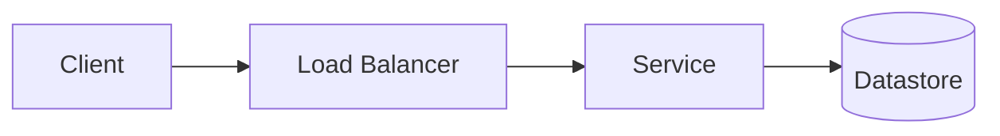

# Case-study template

Every worked case study on this site follows the same 9-part spine. It mirrors the design framework
(`src/content/docs/method/framework.md`) so readers practice the method as they read. The exemplars
to match for depth, voice, and formatting are `src/content/docs/case-studies/chat-whatsapp.md` and
`rate-limiter.md`.

Copy the skeleton below into `src/content/docs/case-studies/<slug>.md`, then **add the page to the
`sidebar` in `astro.config.mjs`** (Case Studies group) or it won't be linked.

````markdown
---
title: "<Human Title>"
description: "<One sentence: the system and the central difficulty it exercises.>"
---

<One paragraph naming the crux — the single hardest tradeoff this problem forces.>

## 1. Requirements

*Functional:* <the core features; explicitly defer the rest.>
*Non-functional:* <scale (users, QPS, data), read/write ratio, latency target, availability,
consistency, durability.>

## 2. Estimation

<Back-of-envelope: traffic (reads vs writes, peak), storage, the one or two numbers that force the
architecture. State the conclusion the numbers drive.>

## 3. API

```
<A handful of endpoints / the core contract, with inputs and outputs.>
```

## 4. Data model & storage choice

<Key entities, relationships, access patterns. Let access patterns drive the store; justify the
SQL vs NoSQL (or KV / wide-column / object-storage) choice.>

## 5. High-level design

<Components and how a request flows through them. Include a Mermaid diagram:>



## 6. Deep dives

<The 2–4 hardest parts — the senior-level signal. Each: the problem, the options, the tradeoff,
the chosen resolution and why.>

## 7. Bottlenecks & scaling

<SPOFs and hot keys/shards, then how you address them. End with a redundancy table.>

## 8. Extensions (optional)

<Things you'd note but not fully design (e.g., encryption, multi-region) — name them as future work.>
````

## Conventions

- Crux-first, tradeoff-obsessed, honest, concise — "learn the trades, not the trivia."
- Body headings start at `##` (the `title` frontmatter is the H1). Use Starlight asides
  (`:::tip` / `:::note` / `:::caution`) for emphasis.
- Cross-link the relevant building blocks and the matching question-bank prompt.
- Diagrams are ` ```mermaid ` fenced blocks (rendered by the `astro-mermaid` integration; they degrade
  to readable source if the integration is removed).
- Always verify with `npm run build` (exit 0, no broken links) before committing.
