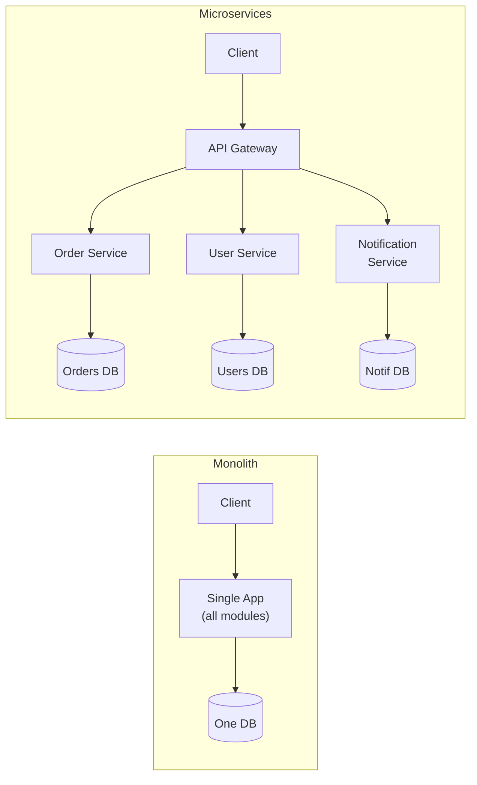

## Monolith vs microservices

- **Monolith:** one deployable application. Simple to build, test, deploy, and reason about; fast in-process calls; easy transactions. The right starting point for most products. Pain shows up at scale: the whole thing redeploys for any change, teams step on each other, and you can't scale parts independently.
- **Microservices:** many small services, each owning its domain and data, deployed independently. Independent scaling and deployment, team autonomy, fault isolation. The costs are heavy: network latency and failure between services, distributed data (no easy joins or transactions), operational complexity (observability, deployment, service discovery), and eventual consistency everywhere.

The mature take: **start with a (well-structured) monolith; extract microservices when you feel concrete pain** (a part needs independent scaling, a team needs autonomy, a component needs isolation). Don't adopt microservices for a system or org that isn't yet feeling those pains — you'll pay all the cost for little benefit.

## Supporting patterns

- **Service discovery** (Consul, etcd, DNS-based): how services find each other's changing addresses in a dynamic environment.
- **API Gateway / Backend-for-Frontend (BFF):** a single entry point that routes, authenticates, rate-limits, and aggregates calls to backend services; a BFF tailors one gateway per client type (web, mobile).
- **Distributed transactions:** when an operation spans services, you can't use one ACID transaction.
  - **Two-Phase Commit (2PC):** a coordinator asks all participants to prepare, then commit. Strong consistency, but **blocking** and the coordinator is a single point of failure. Avoided at scale.
  - **Saga pattern:** model the transaction as a sequence of local transactions, each with a **compensating action** to undo it if a later step fails. Two flavors: **choreography** (services react to each other's events) and **orchestration** (a central coordinator drives the steps). The standard approach for microservice transactions; gives you eventual consistency, not atomicity.
- **CQRS (Command Query Responsibility Segregation):** separate the write model from the read model so each can be optimized (and scaled) independently. Powerful but adds complexity; use when read and write needs genuinely diverge.
- **Event sourcing:** store the sequence of *events* (state changes) as the source of truth rather than current state; rebuild state by replaying events. Gives a full audit log and time travel, at the cost of complexity. Often paired with CQRS.
- **Service mesh (Istio, Linkerd):** offload networking concerns (retries, mTLS, observability, traffic shaping) from application code into a **sidecar** proxy (Envoy) next to each service.
- **Strangler fig:** migrate off a legacy system incrementally — route some traffic to new components, grow them until they "strangle" the old system — instead of a risky big-bang rewrite.

## When to use what

| Style | Best when | Avoid when |
|---|---|---|
| **Monolith** | Early-stage product, small team (< 10 engineers), unclear domain boundaries, low traffic | Team has grown and deployments block each other constantly |
| **Modular monolith** | Domain is understood but team isn't yet large enough to bear microservice overhead; want clear boundaries without network calls | You need truly independent scaling of one hot component |
| **Microservices** | Multiple autonomous teams, genuinely different scaling needs per service, > ~50 engineers or proven pain with a monolith | Greenfield with a small team or immature domain model — you'll build a distributed monolith |
| **Serverless / FaaS** | Event-driven workloads, unpredictable or spiky traffic, glue code and automation, no sustained baseline load | Latency-sensitive hot paths (cold starts), long-running or stateful work, tight control over runtime required |
| **Event-driven** | Decoupled producers and consumers, audit logs, async pipelines, eventual-consistency acceptable | You need strong synchronous consistency or simple request/response with no fan-out |

## Numbers worth knowing

:::note
**Latency budget:** every network hop inside a data center adds roughly **0.5–2 ms** of round-trip time. A monolith with in-process calls pays ~microseconds; a microservice chain of five synchronous hops can add 5–10 ms before a line of business logic runs.

**Team-size thresholds (Conway's Law in practice):** microservices start paying off around 2–3 pizza teams per service (roughly 50+ engineers total). Below that, the operational overhead — separate CI/CD pipelines, on-call rotations, observability stacks — outweighs the autonomy benefit.

**Per-service overhead:** running one microservice in production typically requires a container image, a deployment pipeline, a metrics dashboard, an alerting rule set, and an on-call runbook. Budget ~1–2 engineer-weeks to bootstrap a new service and ~0.5 engineer-days/week ongoing. At 5 services this is manageable; at 50 it is a full platform-engineering team's workload.
:::

## Common pitfalls

- **Premature microservices.** Splitting before domain boundaries are understood leads to the wrong service cuts. Boundaries discovered via pain in a monolith are almost always better than boundaries guessed upfront.
- **The distributed monolith.** Services that share a database, or that require coordinated deployments to function, give you all the operational cost of microservices with none of the isolation benefit. Every service must own its data.
- **Chatty inter-service calls.** Replacing one function call with ten synchronous HTTP/gRPC hops turns a microsecond path into tens of milliseconds and introduces ten new failure points. Batch calls, prefer async events, or reconsider service granularity.
- **No API gateway.** Clients should not call internal services directly. Without a gateway, cross-cutting concerns (auth, rate limiting, TLS termination, versioning) are duplicated across every service or skipped entirely.
- **Shared database across services.** A single database that multiple services write to is a tight coupling disguised as infrastructure. Schema changes become a multi-team coordination problem; the database becomes the bottleneck and a deployment dependency.
- **Ignoring operational readiness.** Microservices demand distributed tracing (Jaeger, Zipkin), structured logging with correlation IDs, and service-level dashboards from day one. Shipping services without these is building technical debt at the operational layer.

## Mini-example: extracting a notification service

A startup's monolith sends emails and push notifications inline in the order-confirmation request handler. As email volume spikes, slow SMTP calls add 300 ms to checkout latency. The fix: extract a `notification-service` that consumes an `order.confirmed` event from a queue. The monolith publishes the event and returns immediately (< 5 ms); the notification service processes it asynchronously. This is the archetypal "extract when you feel pain" move — one concrete scaling pain, one clean service boundary, one async seam.

## Architecture topology: monolith vs microservices

