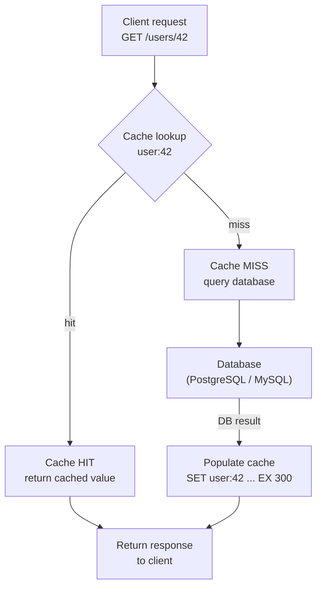

Caching is the highest-leverage performance tool you have. The principle: keep frequently accessed data closer/faster than its source of truth.

## Where caches live (multiple layers)

Browser/client cache → CDN (edge) → API/application cache → in-memory distributed cache (Redis/Memcached) → database's own cache. Each layer absorbs load from the next.

## Caching strategies (read + write patterns)

- **Cache-aside (lazy loading):** application checks the cache; on a miss, reads the DB and populates the cache. The most common pattern. Only requested data is cached; the cost is a slower first request and a brief staleness window after updates.
- **Read-through:** the cache itself fetches from the DB on a miss (the app only talks to the cache). Cleaner app code; the cache library handles loading.
- **Write-through:** write to cache and DB together, synchronously. Cache is always fresh; writes are slower.
- **Write-back (write-behind):** write to cache immediately, flush to DB asynchronously. Very fast writes, but risk of data loss if the cache dies before flushing.
- **Write-around:** write straight to the DB, skip the cache; the cache fills on later reads. Good when written data isn't read soon.

## Eviction policies

When the cache is full, what gets thrown out? **LRU** (least recently used — the default and usually right), **LFU** (least frequently used), **FIFO**, **TTL** (expire after a time), or random.

## The hard parts of caching

- **Cache invalidation** — "there are only two hard things in computer science…" Keeping the cache consistent with the source of truth is genuinely difficult. Tools: TTLs (accept bounded staleness), write-through, explicit invalidation on update, and versioned keys.
- **Cache stampede / thundering herd** — a popular key expires and thousands of requests miss simultaneously, all hammering the DB. Fixes: request coalescing (let one request rebuild while others wait), staggered/jittered TTLs, and serving stale-while-revalidate.
- **Cache penetration** — repeated queries for keys that don't exist bypass the cache and hit the DB. Fixes: cache the "not found" result, or front the cache with a **Bloom filter**.
- **Hot key** — a single key gets disproportionate traffic. Fixes: replicate that key across nodes, or add a local in-process cache in front.

## CDN (Content Delivery Network)

A geographically distributed cache for static (and increasingly dynamic) content — images, video, JS/CSS, even API responses. Serves users from a nearby **edge** location, slashing latency and offloading your origin. Essential for any global, media-heavy product.

## When to use what — caching pattern decision table

| Pattern | Best for | Watch out for |
|---|---|---|
| **Cache-aside** (lazy loading) | General-purpose reads; you want fine control over what gets cached | First-request miss penalty; stale data if you forget explicit invalidation on writes |
| **Read-through** | Cleaner app code — the cache library owns DB loading | Cold-start misses on deployment; shared cache means one miss can trigger duplicate DB fetches (stampede) |
| **Write-through** | Data that is read immediately after it is written (user profile updates) | Write latency doubles — every write hits both cache and DB synchronously |
| **Write-back** (write-behind) | Write-heavy workloads where write latency is the bottleneck (counters, metrics) | Data loss window — a cache crash before the async flush loses acknowledged writes |
| **Write-around** | Bulk loads or one-off writes unlikely to be re-read soon | Cold reads after writes; the next read pays the full DB round-trip cost |

## Numbers worth anchoring on

:::note
- **Target hit ratio:** 95–99%. Below 90% the cache is barely helping — audit what is being missed.
- **Redis throughput:** ~100 K+ read/write operations per second per node with sub-millisecond latency at p99.
- **The 80/20 rule:** roughly 20% of your data serves ~80% of reads. A well-sized cache capturing that 20% dramatically reduces DB load.
- **Warm-up time matters:** a freshly deployed cache starts at 0% hit ratio. Pre-warm with a read-through sweep of hot keys before shifting production traffic.
:::

## Common pitfalls

- **Cache stampede / thundering herd.** A popular key expires and hundreds of simultaneous misses all hit the DB at once. Fix: request coalescing (one goroutine/thread rebuilds the key while others wait), jittered TTLs, or serve stale-while-revalidate until the rebuild completes.
- **Stale data with no invalidation strategy.** Writing to the DB without touching the cache leaves stale data indefinitely. Decide upfront: TTL-based bounded staleness, explicit delete-on-write, or write-through — never leave it implicit.
- **No TTL.** A cache entry with no expiry is a memory leak and a correctness hazard. Every key must have a TTL, even if it is long.
- **Caching everything.** Caching rarely accessed data wastes memory and pushes out hot keys. Cache the hot 20%; let the long tail go to the DB.
- **Unbounded keyspace / no eviction policy.** A cache that grows without limit until the process OOMs is worse than no cache. Set a `maxmemory` limit in Redis and choose an eviction policy (`allkeys-lru` is the safe default).
- **Caching mutable aggregate results without thinking about invalidation.** Cached counts, rankings, or aggregates go stale on every write to their source data. Either use very short TTLs or invalidate the aggregate key on every relevant write.

## Worked example — cache-aside for a user profile service

A social app serves `GET /users/{id}` at 100 K requests/minute. Each call hit PostgreSQL, saturating the read replica. Adding Redis cache-aside: on each request, check `user:{id}`; on a hit, return in under 1 ms. On a miss, read from Postgres, write to `user:{id}` with a 5-minute TTL, and return. With a 97% hit ratio, Postgres now handles only ~3 K reads/minute — a 97% reduction — and the p99 latency drops from 20 ms to under 2 ms.

## Cache-aside read path

