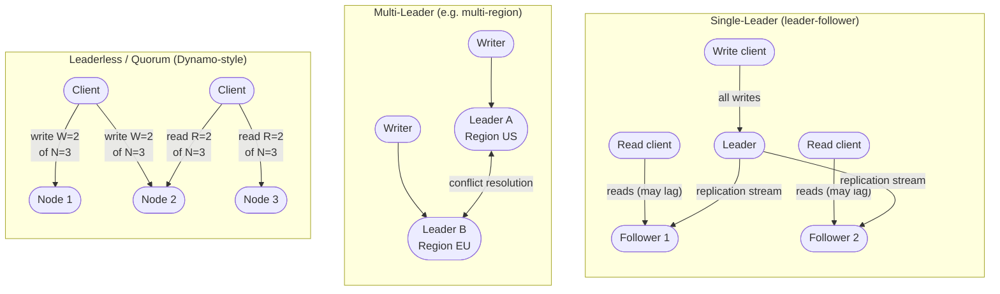

This is the heart of system design. Most hard problems are data problems.

## SQL (relational) vs NoSQL

**Relational (PostgreSQL, MySQL):** structured tables, fixed schema, **joins**, and strong **ACID** transactions. Choose when: data is highly structured and relational, you need complex queries and transactional integrity, and consistency matters (finance, orders, anything with invariants). Traditionally scaled vertically; scales horizontally with more effort (read replicas, then sharding).

**NoSQL** is an umbrella for four shapes:

- **Key-value (Redis, DynamoDB):** a giant hash map. Blazing fast lookups by key. For caching, sessions, simple high-throughput lookups.
- **Document (MongoDB):** stores JSON-like documents, flexible schema. For semi-structured data, content, catalogs, fast iteration.
- **Wide-column (Cassandra, HBase, Bigtable):** rows with dynamic columns, partitioned across many nodes. For massive write throughput and time-series/event data at scale.
- **Graph (Neo4j):** nodes and edges as first-class citizens. For relationship-heavy queries (social graphs, fraud rings, recommendations).

The honest rule of thumb: **default to relational** until you have a concrete reason not to (scale, schema flexibility, or a specific access pattern). "We'll need NoSQL someday" is not a reason. NoSQL trades joins/transactions for horizontal scale and flexibility — make sure that's the trade you actually need.

## Indexing

An index is a data structure that makes reads fast at the cost of slower writes and extra storage (the database maintains the index on every write). Two dominant internals:

- **B-tree / B+tree:** balanced, sorted, read-optimized. Great for range queries and point lookups. Used by most relational databases.
- **LSM-tree (Log-Structured Merge tree) + SSTables:** buffers writes in memory, flushes sorted files to disk, merges them in the background. **Write-optimized.** Used by Cassandra, RocksDB, LevelDB. The tradeoff: faster writes, but reads may touch multiple files (mitigated with Bloom filters).

Knowing "B-tree = read-optimized, LSM = write-optimized" lets you justify a database choice from the workload.

## Replication (copies for availability and read scaling)

- **Single-leader (leader-follower / primary-replica):** all writes go to the leader, which streams changes to followers. Reads can be served by followers → **read scaling**. If the leader dies, a follower is promoted (**failover**). The catch: **replication lag** means followers can be slightly stale (an eventual-consistency window).
- **Multi-leader:** multiple nodes accept writes (e.g., one per region). Better write availability and locality, but you must resolve **write conflicts**.
- **Leaderless (Dynamo-style, e.g., Cassandra):** any replica accepts reads/writes; use **quorums** — if you write to W replicas and read from R, and `R + W > N` (N = total replicas), reads are guaranteed to see the latest write. Tunable consistency.

## Partitioning / sharding (splitting data across machines)

When data or write load outgrows one machine, split it into **shards**, each on its own node. Strategies:

- **Range partitioning:** by key range (A–F on shard 1, etc.). Good for range scans; risks **hot spots** if traffic clusters in one range.
- **Hash partitioning:** hash the key to pick a shard. Even distribution; loses efficient range queries.
- **Directory/geo partitioning:** explicit lookup table, or by region.

**Consistent hashing** is the key technique: it maps both keys and nodes onto a ring so that adding or removing a node only reshuffles a small fraction of keys (instead of remapping everything). **Virtual nodes** smooth out the distribution. This is how distributed caches and databases add/remove capacity gracefully.

The recurring villain is the **hot shard / hot key** — one celebrity user, one viral item, or a bad partition key concentrating load. Mitigations: better key choice, splitting hot keys, adding a per-key cache, or salting.

Other tools: **denormalization** (duplicating data to avoid expensive joins — trade storage and write complexity for read speed), and **federation** (splitting databases by feature/function rather than by row).

## OLTP vs OLAP

- **OLTP (Online Transaction Processing):** many small, fast read/write transactions — your application's primary database. Row-oriented.
- **OLAP (Online Analytical Processing):** few huge analytical queries scanning lots of data — your **data warehouse** (Snowflake, BigQuery, Redshift). Column-oriented (reading a few columns over billions of rows is cheap).

Don't run heavy analytics on your production OLTP database; pipe data into a warehouse instead (via ETL/ELT or change-data-capture).

## Object/blob storage

For large unstructured files (images, video, backups, logs), use **object storage** (S3 and equivalents), not a database. It's cheap, effectively infinite, durable, and pairs naturally with a CDN. Store the *file* in object storage and just the *metadata + URL* in your database.

## When to use what

| Need / workload | Reach for | Why |
|---|---|---|
| Structured data, joins, transactions | **PostgreSQL / MySQL** | ACID, relational integrity, rich query language |
| Low-latency key lookups, caching, sessions | **Redis** | Sub-ms in-memory reads/writes, TTL support |
| Flexible schema, document-shaped data | **MongoDB** | Schema-free JSON documents, easy iteration |
| Simple, high-throughput key-value at cloud scale | **DynamoDB** | Serverless, auto-scaling, single-digit ms at any size |
| Massive write throughput, time-series, events | **Cassandra / HBase** | LSM-tree writes, linear horizontal scale, tunable consistency |
| Relationship-heavy queries (social graph, fraud) | **Neo4j** | Joins across deep edges are O(1) traversals, not table scans |
| Large files, media, backups, static assets | **S3 / object storage** | Cheap, durable, CDN-friendly — not a database |
| Full-text search, faceted search | **Elasticsearch** | Inverted index, relevance scoring, aggregations |
| Analytical queries over huge datasets | **Snowflake / BigQuery / Redshift** | Columnar storage, optimized for scans, not OLTP |

Default path: start with PostgreSQL. Add Redis for caching. Only graduate to a specialist store when you have a concrete workload reason.

## Numbers worth knowing

:::note
**Rough order-of-magnitude figures for interview estimates**

| Metric | Ballpark |
|---|---|
| Single Postgres node write ceiling | ~5–10 K writes/s (simple inserts, SSD-backed) |
| Replication lag (leader → follower) | Typically 1–100 ms; spikes to seconds under heavy load |
| Practical rows-per-table before sharding | ~100–500 M rows (indexes still fit in RAM, queries stay fast) |
| Index write overhead | 10–30% extra write latency per secondary index; every index must be updated on every write |

These are starting points, not hard limits — tune for your schema and access patterns.
:::

## Common pitfalls

- **Premature NoSQL.** Choosing a document or wide-column store before you understand your access patterns locks you into rigid query limitations without the scale benefits. Start relational; migrate when you have evidence of a bottleneck.
- **Hot shard / bad partition key.** Partitioning by `user_id` sounds right until one celebrity concentrates 10% of traffic on one shard. Cardinality and traffic distribution both matter. Test with a skewed dataset before going live.
- **N+1 queries.** Loading a list of 50 orders and then issuing a separate query per order for its customer details. Fix with a JOIN, a batch fetch, or an ORM `includes`/`eager_load`. This is the single most common OLTP performance killer.
- **Missing indexes on hot read paths.** A table scan on 10M rows is acceptable in development (< 1 s); in production at 1 K reads/s it melts the database. Identify your read access patterns before launch and index them.
- **Over-indexing on write-heavy tables.** Every secondary index is a hidden write cost. An event log with 8 indexes pays 8× the write amplification. Index for reads you actually run.
- **Running analytics on the OLTP primary.** A single long-running `SELECT SUM(...)` against a 500 M-row orders table can hold locks or saturate I/O and kill application latency. Use a read replica for heavy queries, or ship data to a warehouse.

## Mini-example: choosing a store for a ride-sharing app

A ride-sharing app has three distinct data needs:

1. **Rider/driver profiles, payment records** → PostgreSQL. Relational, ACID, small row count, complex queries (fraud joins, trip history).
2. **Active driver locations** (lat/lng updated every 4 s by millions of drivers) → Redis with geospatial indexes (`GEOADD`/`GEORADIUS`). Write-heavy, no durability requirement (the driver will resend in 4 s), sub-ms reads for the matching service.
3. **Trip events log** (GPS traces, timestamps, fare events) → Cassandra. Partitioned by `trip_id`, write-optimized LSM, append-only, queried only by `trip_id`.

Three stores, three access patterns. Reach for each tool only when the workload demands it.

## Replication topology diagram

:::note
**Quorum condition:** `R + W > N` guarantees at least one replica in every read set overlaps with every write set, so you always see the latest write. Example: N=3, W=2, R=2 → 2+2=4 > 3. ✓
:::
