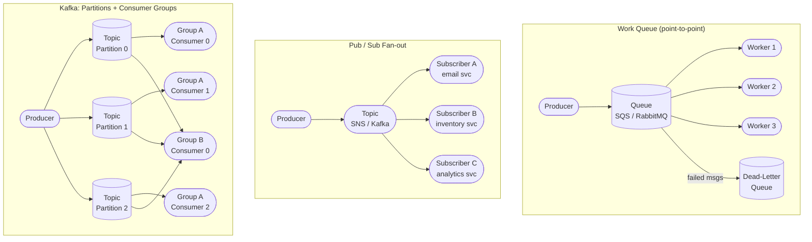

Synchronous calls are simple but couple services tightly and propagate failure. **Asynchronous messaging** decouples producers from consumers, smooths out load spikes, and lets parts fail independently. This is one of the biggest leaps from POC thinking ("call the function and wait") to production thinking ("emit an event, let the system handle it").

## Queues vs pub/sub

- **Message queue (point-to-point):** a producer puts a message on a queue; one consumer takes it. For distributing work (task queues). Buffers bursts so a slow downstream doesn't drop requests.
- **Publish/subscribe (pub/sub):** a producer publishes to a topic; *many* subscribers each get a copy. For broadcasting events ("order placed" → email service, analytics, inventory, all react).

Common systems: **Kafka** (a distributed, partitioned, durable commit log — extremely high throughput, retains messages, consumer groups, ordering *within a partition* — the backbone of event-driven and streaming architectures); **RabbitMQ** (a flexible traditional broker with rich routing); **SQS** (a managed cloud queue).

## Delivery semantics (and why idempotency matters)

- **At-most-once:** may be lost, never duplicated. (Fire and forget.)
- **At-least-once:** never lost, may be duplicated. **The common, practical choice.**
- **Exactly-once:** never lost, never duplicated. Genuinely hard and often a partial illusion; usually achieved as "at-least-once delivery + idempotent processing."

Because at-least-once is normal, **idempotency** is essential: design operations so that processing the same message twice has the same effect as once (e.g., "set balance to X" is idempotent; "add $10" is not — make it idempotent with an idempotency key that dedupes retries). This is a core production skill that POC code usually ignores.

## Other essentials

- **Dead-letter queue (DLQ):** messages that keep failing get moved aside for inspection instead of blocking the queue forever.
- **Backpressure:** when consumers can't keep up, the system must push back — buffer, shed load, or signal producers to slow down — rather than melt down.
- **Stream vs batch processing:** **batch** processes large bounded datasets periodically (Spark, the old MapReduce model) — high throughput, high latency. **Stream** processes events continuously as they arrive (Kafka Streams, Flink) — low latency. Many systems use both (the "Lambda"/"Kappa" architectures).

## When to use what

| Pattern | Tool(s) | Use when |
|---|---|---|
| **Task / work queue** (point-to-point) | SQS, RabbitMQ | One worker should process each job; distribute load across a pool of workers; retry on failure; need a DLQ |
| **Pub/sub fan-out** (broadcast) | SNS, Redis pub/sub | One event → multiple independent subscribers each get their own copy; fan-out to N downstream services |
| **Distributed log / stream** | Kafka, Kinesis | High-throughput event stream; consumers read at their own pace; replay from any offset; ordering within a partition; event sourcing |
| **Simple in-process / low-latency pub/sub** | Redis pub/sub | Lightweight real-time notifications within a single datacenter; no persistence needed; fire-and-forget acceptable |
| **Scheduled / delayed jobs** | SQS delay, RabbitMQ TTL, Sidekiq | Work that should execute at a future time or after a cooling-off period |

Key split: **queue = competing consumers, one message → one worker**. **Pub/sub = broadcast, one message → every subscriber**. Kafka blurs the line: a consumer group competes internally (queue semantics) while multiple consumer groups each see every message (pub/sub semantics).

## Numbers worth knowing

:::note
**Kafka throughput and operational facts**

| Metric | Ballpark |
|---|---|
| Kafka single-broker throughput | 100 K–1 M+ messages/second (disk-sequential writes) |
| Kafka default retention | 7 days (configurable; can be unlimited for log compaction) |
| Parallelism ceiling | One partition → one consumer in a group; to add consumers, add partitions first |
| SQS standard queue latency | Single-digit ms; at-least-once; no ordering guarantee |
| RabbitMQ throughput | ~20–50 K msgs/s per node (lower than Kafka; richer routing) |

Kafka achieves high throughput via sequential disk I/O, batching, and zero-copy sends — it intentionally avoids per-message fsync.
:::

## Common pitfalls

- **No dead-letter queue.** A message that always fails (bad payload, downstream bug) keeps retrying forever, blocking the queue and burning consumer cycles. Configure a DLQ and alert on it; every production queue needs one.
- **Assuming ordering across partitions.** Kafka guarantees ordering *within* a partition, not across partitions. If two events for the same entity land on different partitions, consumers see them out of order. Partition by entity ID (e.g., `order_id`) to co-locate related events.
- **Not handling duplicate delivery.** At-least-once is the default in every major queue. If your consumer increments a counter or charges a card, receiving the same message twice produces incorrect results. Design consumers to be idempotent — use an idempotency key and check-before-act or conditional writes.
- **Poison messages crashing the consumer.** A malformed message that throws an uncaught exception will crash the consumer in a loop until the process is restarted, stalling the entire partition. Wrap message handling in a try/catch; send unparseable messages to a DLQ immediately.
- **Unbounded consumer lag.** If producers outpace consumers, the offset gap grows. In Kafka this is invisible until you run out of disk. Monitor consumer-group lag (`kafka-consumer-groups.sh --describe`) and alert when it exceeds a threshold. Lag is the first sign that you need more partitions or more consumer instances.
- **Treating a queue as a database.** Queues are for in-flight work, not durable storage. If you need to query "all orders placed in the last hour," use a database. Queues are for transit; stores are for persistence.

## Mini-example: order processing pipeline

An e-commerce checkout emits an `order_placed` event. Several independent services must react:

- **Email service** — send a confirmation email.
- **Inventory service** — reserve stock.
- **Analytics service** — record the revenue event.

**Wrong approach:** the checkout service calls each downstream synchronously. A slow email provider delays the HTTP response; an inventory outage fails the whole checkout.

**Right approach:** checkout publishes `order_placed` to an **SNS topic** (or Kafka topic). Each downstream subscribes independently. Email, inventory, and analytics each have their own SQS queue fed by SNS fan-out. Each queue has a DLQ. Checkout returns success as soon as the event is published. Each consumer retries independently; failures are isolated.

For the inventory service specifically, idempotency matters: if the `reserve_stock` message is delivered twice, the second delivery should detect "already reserved for order_id X" and be a no-op.

## Messaging topology diagram

:::note
In the Kafka model, **Consumer Group A** splits the three partitions across three instances (work-queue semantics within the group). **Consumer Group B** independently reads all three partitions at its own offset — each group sees every message (pub/sub semantics across groups).
:::
