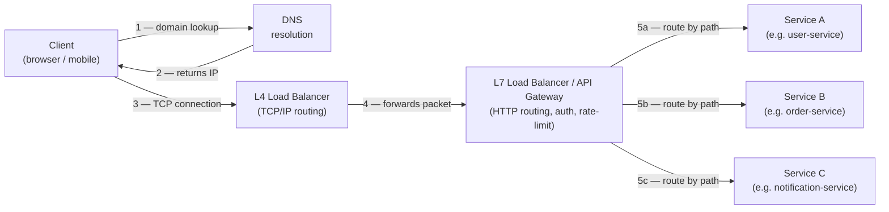

## The path of a request

`DNS → Load Balancer → (API Gateway) → Application servers → datastores/caches`. Know each hop.

- **DNS** turns a domain into an IP address. It's also a coarse load-balancing and routing tool (geo-routing, failover). Cached aggressively (TTLs), so DNS changes propagate slowly.
- **Load balancer (LB)** distributes traffic across servers, removing dead ones via health checks. It's how horizontal scaling becomes invisible to clients.
- **API Gateway** (often in front of microservices) handles cross-cutting concerns in one place: auth, rate limiting, routing, request aggregation, TLS termination.

## Load balancing — L4 vs L7 and algorithms

- **L4 (transport layer):** routes by IP/port without looking at the payload. Fast, protocol-agnostic.
- **L7 (application layer):** understands HTTP — can route by URL path, headers, cookies; do TLS termination and content-based routing. More flexible, slightly more overhead. Most web LBs are L7.

Common distribution algorithms: **round robin** (rotate), **weighted round robin** (bigger servers get more), **least connections** (send to the least busy), **least response time**, and **consistent hashing / IP hash** (same client → same server, important for sticky sessions and cache locality).

## API paradigms — pick the right shape

- **REST** — resources addressed by URLs, manipulated with HTTP verbs (GET/POST/PUT/DELETE), stateless. Ubiquitous, cacheable, simple. Can over-fetch (you get the whole object) or under-fetch (need multiple round trips).
- **GraphQL** — one endpoint; the client specifies exactly which fields it wants. Kills over/under-fetching, great for mobile and complex UIs. Costs: harder caching, query complexity/N+1 risks on the server.
- **gRPC** — binary (Protocol Buffers) over HTTP/2. Fast, strongly typed, supports streaming. The default for **internal service-to-service** calls. Less browser-friendly.
- **WebSockets** — persistent, full-duplex connection. For real-time bidirectional comms: chat, live dashboards, multiplayer, collaborative editing.
- **Server-Sent Events (SSE)** — one-way server→client stream over plain HTTP. Simpler than WebSockets when you only need to push (notifications, live scores).
- **Long polling** — client request hangs until the server has data. A fallback for "near real-time" without persistent connections.
- **Webhooks** — the server calls *your* URL when an event happens. The pattern for third-party event delivery (Stripe, GitHub).

## Protocols worth knowing

- **TCP** — reliable, ordered, connection-based. The default for almost everything.
- **UDP** — fast, connectionless, no delivery/order guarantees. For where speed beats reliability: video/voice, gaming, DNS.
- **HTTP/1.1 → HTTP/2 → HTTP/3:** 1.1 has head-of-line blocking; 2 adds multiplexing (many requests over one connection) and binary framing; 3 runs over QUIC (UDP-based), removing TCP-level head-of-line blocking and speeding up connection setup.

## When to use what — API paradigm decision table

| Paradigm | Best for | Avoid when |
|---|---|---|
| **REST** | Public APIs, CRUD resources, cacheable reads | Fine-grained mobile UIs with many different shapes of data |
| **gRPC** | Internal service-to-service calls; high-throughput, low-latency | Browser clients (limited native support); human-readable debugging |
| **GraphQL** | Complex UIs needing flexible data shapes; BFF (backend-for-frontend) layer | Simple CRUD; teams without GraphQL expertise; need HTTP caching |
| **WebSocket** | Real-time bidirectional comms — chat, multiplayer, collaborative editing | One-way pushes; servers that cannot hold thousands of open connections |
| **Server-Sent Events** | Server→client push only — notifications, live scores, dashboards | Two-way communication; non-HTTP/2 proxies that buffer chunked responses |
| **Long polling** | Near real-time when WebSockets or SSE are unavailable | High-frequency updates (thundering-herd risk on reconnect) |
| **Short polling** | Simple "check occasionally" — job status, occasional refresh | Any latency-sensitive use case; wastes requests when nothing changes |

## Numbers worth anchoring on

:::note
- **Same-datacenter round-trip:** ~0.5 ms (sub-millisecond).
- **Cross-region round-trip** (e.g., US ↔ Europe): ~150 ms — making synchronous cross-region calls expensive and fragile.
- **Typical JSON payload:** a lean API response is 1–10 KB; a fat one with embedded lists can hit 100 KB+. A small payload keeps mobile latency predictable.
- **Single server concurrent-connection ceiling:** a well-tuned Linux server handles ~50 K–100 K simultaneous TCP connections before memory and file-descriptor limits bite. WebSocket gateway nodes are typically sized at ~50 K connections each.
:::

## Common pitfalls

- **Chatty / N+1 API calls.** A client loops over N items and issues a separate request per item. Fix: design batch endpoints or use GraphQL to fetch exactly what you need in one round trip.
- **Missing timeouts and retries.** Every outbound call must have a deadline; without one, a slow downstream hangs your thread pool. Pair retries with **exponential backoff + jitter** to avoid retry storms.
- **Ignoring backpressure.** Producers that can overwhelm consumers — whether a client flooding a WebSocket or a service flooding a downstream API — need flow control. Explicit rate-limiting and bounded queues are the tools.
- **No pagination.** Returning unbounded lists (`GET /messages`) is a latency and memory time bomb. Always design list endpoints with cursor- or offset-based pagination from day one.
- **Synchronous cross-region calls in the request path.** A 150 ms cross-region hop makes p99 latency terrible. Move cross-region work to async jobs or async replication; serve reads from local replicas.
- **Forgetting idempotency.** Retried POST calls can double-create resources. Every mutating endpoint that will be retried needs an idempotency key so the server can deduplicate safely.

## Worked example — avoiding N+1 with batching

An e-commerce page fetches a list of 50 orders and then issues one `GET /users/{id}` request per order to display the buyer's name — 51 requests total. Replacing this with a single `POST /users/batch` that accepts an array of IDs collapses 50 round trips into one, cutting latency by 98%. Alternatively, a GraphQL query returns orders and their nested user fields together, with the resolver batched via a DataLoader.

## Request flow diagram

