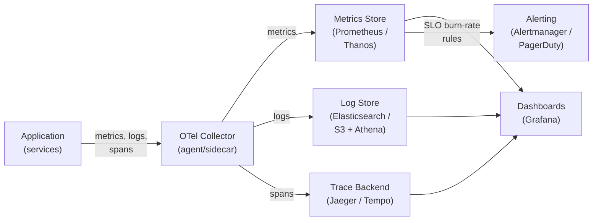

You can't operate what you can't see. Observability is the difference between "the system is slow" and "the p99 of the payments service spiked because the inventory DB's connection pool is exhausted."

## The three pillars

- **Logs:** discrete, timestamped events. Detailed, great for debugging; expensive at volume (sample/aggregate). Use structured logging.
- **Metrics:** numeric time-series aggregates (request rate, error rate, latency percentiles, CPU). Cheap, ideal for dashboards and alerts.
- **Traces:** the path of a single request across all services, with timing per hop. **Distributed tracing** (trace IDs + span IDs; tools like Jaeger, Zipkin, OpenTelemetry) is how you debug latency in a microservices system.

## SLI / SLO / SLA and error budgets

- **SLI (Indicator):** a measured signal — e.g., "% of requests under 200ms."
- **SLO (Objective):** your internal target for that SLI — e.g., "99.9% under 200ms."
- **SLA (Agreement):** the external contract with consequences (refunds/penalties) if missed. Your SLO should be stricter than your SLA.
- **Error budget:** the allowed unreliability (100% − SLO). It turns reliability into a currency: if you've got budget left, ship features faster; if you've burned it, slow down and stabilize.

## Safe deployment

- **Rolling:** update instances in batches.
- **Blue-green:** run two identical environments; switch traffic from old (blue) to new (green) instantly, roll back by switching back.
- **Canary:** release to a small % of users first, watch metrics, then ramp up.
- **Feature flags:** decouple *deploy* from *release* — ship code dark, turn it on gradually, kill it instantly without a redeploy.

## When to reach for each pillar

The three pillars answer different questions. Knowing which tool to reach for first saves hours of debugging.

| Pillar | Primary question answered | Best for | Avoid when |
|---|---|---|---|
| **Logs** | "What exactly happened at time T?" | Debugging a specific error, auditing, tracing individual requests in a monolith | High-volume hot paths (cost explodes; sample or aggregate instead) |
| **Metrics** | "Is the system healthy right now? What's the trend?" | Dashboards, alerting, capacity planning, SLO burn tracking | Diagnosing the *root cause* of a spike (metrics tell you *that* it broke, not *why*) |
| **Traces** | "Where did this request spend its time across services?" | Latency debugging in microservices, finding which downstream call is slow | Monoliths where a single log line suffices; very high request rates without sampling |
| **Alerting** | "Do I need to wake someone up?" | SLO burn-rate alerts on user-facing symptoms | Alerting on causes (CPU > 80%) instead of effects (error-rate SLO burning) |

The golden path: **metrics surface the symptom → traces isolate the service → logs explain the event**.

## Numbers worth knowing

:::note
**Metric cardinality:** A time series per `{service, endpoint, status_code}` is fine. A time series per `{service, endpoint, user_id}` is catastrophic — 10M users × 100 endpoints = 1B series, enough to OOM Prometheus. Keep label cardinality below ~10K values per label.

**Log volume:** 1 KB/log line × 10K req/s = 10 MB/s → 864 GB/day before replication. At $0.50/GB/month that is $13K/month. Sample hot paths at 1–5%; aggregate structured logs into metrics for the rest.

**Trace sampling:** Full sampling at 10K req/s is impractical. Head-based sampling at **1–10%** is standard. Tail-based sampling (keep traces for slow/error requests) is better but more complex. A 1% sample still gives statistically meaningful p99 latency data.

**SLO burn-rate alerting:** A 1-hour burn-rate alert that fires when you're consuming 14× your error budget gives ~5 minutes to react before 1% of your monthly budget is gone. Alert on *budget burn*, not on absolute error counts.
:::

## Common pitfalls

- **High-cardinality metric labels.** Adding `user_id`, `request_id`, or `session_id` as metric labels generates one time series per unique value. This is the single most common way to crash a metrics store. Labels must have bounded cardinality.
- **Logging everything at DEBUG level in production.** It feels thorough but drowns signal in noise and runs up storage bills. Set production log levels to INFO or WARN; use sampling for high-throughput paths.
- **No correlation IDs across services.** Without a `trace_id` or `request_id` threaded through every log line and service call, debugging a failure that crosses two service boundaries means manually correlating timestamps — expensive and error-prone. Inject a correlation ID at the edge and propagate it everywhere.
- **Alerting on causes instead of symptoms.** "CPU > 80%" does not mean users are hurting. "Error budget burning at 5×" does. Alert on user-facing SLIs (latency, error rate, availability); treat infrastructure metrics as diagnostic tools, not alert triggers.
- **No SLOs defined.** Without an explicit SLO, every incident is equally important and every alert is debated. SLOs create an objective standard: is the error budget burning? If yes, act; if no, the system is fine by definition.
- **Treating logs as the only observability source.** In a microservices system, logs alone cannot answer "why is the p99 high?" without distributed tracing. Stand up OpenTelemetry early — retrofitting trace instrumentation into a large codebase is painful.

## Worked example: diagnosing a checkout latency spike

The payments SLO (99.5% of requests under 500ms) fires a burn-rate alert. Here is the playbook:

1. **Metrics dashboard** (Grafana): the `payments-service` p99 latency jumped from 120ms to 800ms at 14:32. Error rate is flat — it is a *latency* issue, not an *error* issue.
2. **Traces** (Jaeger): sample slow traces from 14:32–14:40. Every slow trace shows a 650ms span on the call to `inventory-db`. The `payments-service` itself is fast.
3. **Logs** (Elasticsearch): filter `service=inventory-db level=WARN` around 14:32. Thousands of `connection pool exhausted: waiting for available connection` log lines appear at 14:31.

Root cause: a batch job consuming the inventory DB connection pool. Fix: give the batch job its own read replica. Resolution time with this playbook: under 15 minutes.

Without traces, step 2 would have required reading logs across five services manually. Without structured logs with a `level` field and `service` label, step 3 would have been grep through gigabytes.

## Observability pipeline

