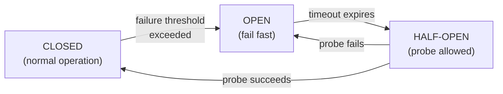

Failure isn't an edge case at scale; it's constant. Design assuming components *will* fail.

## Eliminate single points of failure (SPOF)

Any component whose failure takes down the system is a SPOF. Remove them with **redundancy**: run multiple instances of everything, across multiple availability zones/regions.

- **Failover models:** **active-passive** (a standby takes over when the primary fails — simpler, some failover delay) vs **active-active** (all instances serve traffic — better utilization and instant failover, but needs careful state coordination).

## Resilience patterns (stop failures from cascading)

- **Timeout:** never wait forever on a dependency; fail fast.
- **Retry with exponential backoff + jitter:** retry transient failures, but back off increasingly and add randomness so all clients don't retry in sync (a "retry storm").
- **Circuit breaker:** if a dependency keeps failing, "open the circuit" and fail fast for a while instead of hammering it; periodically test (half-open) before closing again. Prevents one sick service from dragging everything down.
- **Bulkhead:** isolate resources (thread pools, connection pools) per dependency so one overloaded dependency can't starve the rest — like watertight compartments in a ship.
- **Load shedding & graceful degradation:** under extreme load, drop or reject lower-priority work, and serve a reduced experience (stale data, fewer features) rather than failing entirely. A search box that falls back to "no autocomplete" still works.

## Rate limiting (protect yourself and ensure fairness)

Five algorithms, roughly increasing in sophistication:

- **Fixed window:** count requests per fixed time window. Simple, but allows 2× bursts at window boundaries.
- **Sliding window log:** store timestamps of each request; perfectly accurate but memory-heavy.
- **Sliding window counter:** approximate the sliding window using weighted adjacent fixed windows. Efficient and good enough — common in practice.
- **Token bucket:** tokens refill at a steady rate up to a cap; each request consumes one. **Allows controlled bursts.** Widely used.
- **Leaky bucket:** requests queue and drain at a constant rate. **Smooths** bursts into a steady stream.

## Disaster recovery

- **RPO (Recovery Point Objective):** how much data you can afford to lose (drives backup frequency / replication).
- **RTO (Recovery Time Objective):** how fast you must be back up (drives standby/failover strategy).
- Tactics: regular **backups** (and *tested* restores), cross-region replication, and **chaos engineering** (deliberately injecting failures — à la Netflix's Chaos Monkey — to prove the system survives them).

## When to use which resilience pattern

| Pattern | Use when | Skip / reconsider when |
|---|---|---|
| **Timeout** | Calling any remote dependency (always) | Never skip; the only question is what value to set |
| **Retry + exponential backoff + jitter** | Transient, idempotent failures (network blips, 429s, 503s) | Non-idempotent operations (use idempotency keys first); when the downstream is already overloaded (retry worsens it) |
| **Circuit breaker** | A dependency has known failure modes that take seconds to minutes to self-heal; you can serve a degraded response in the meantime | One-off, short-lived calls where the overhead isn't worth it; very low-traffic paths where the breaker never accumulates enough signal |
| **Bulkhead** | A single slow or failing dependency threatens to exhaust shared resources (thread pools, connection pools) | Simple services with a single dependency where isolation adds no benefit |
| **Rate limiting** | Protecting a service from overload; enforcing per-tenant fairness; defending public APIs against abuse | Internal service-to-service calls behind a controlled load balancer (usually unnecessary) |
| **Graceful degradation / fallback** | Core functionality can continue at reduced quality when a non-critical dependency fails (e.g., recommendations, autocomplete) | Fallback introduces its own risk or the degraded path is indistinguishable from a silent data-loss bug |

## Numbers worth knowing

:::note
**Availability nines — what they mean in practice:**

| SLA | Downtime per year | Downtime per month |
|---|---|---|
| 99% ("two nines") | 3.65 days | 7.3 hours |
| 99.9% ("three nines") | 8.77 hours | 43.8 minutes |
| 99.99% ("four nines") | 52.6 minutes | 4.4 minutes |
| 99.999% ("five nines") | 5.26 minutes | 26 seconds |

**Chained-dependency availability** multiplies. Four services each at 99.9% uptime give you 0.999⁴ ≈ 99.6% end-to-end — that's 3.5 days of downtime per year even if each service is fine on its own. Decouple critical paths with async messaging or caching to break the chain.

**Timeout budgets:** a typical inter-service call within a data center should time out in **50–200 ms** for synchronous user-facing paths. Batch/async paths can tolerate 1–5 s. Database queries for p99 fast paths: < 50 ms. Never leave a timeout at "infinity" (the library default) — it will eventually become a thread leak.
:::

## Common pitfalls

- **Retry storms (no backoff or jitter).** When many clients all retry on the same schedule after a blip, they produce a thundering-herd that overwhelms the recovering service. Exponential backoff with random jitter (±30–50 % of the wait) spreads the load. Failing to add jitter is the single most common retry mistake.
- **No timeouts anywhere.** Threads blocked indefinitely waiting on a slow dependency will accumulate until the thread pool exhausts, turning a partial outage in one service into a full outage in the caller. Every network call must have a timeout.
- **Cascading failures.** Without bulkheads and circuit breakers, one degraded downstream service can exhaust all connection-pool threads in the caller, which then appears to fail to its callers, spreading the failure up the stack. Isolate failure domains.
- **Circuit breaker never trips.** A poorly tuned breaker (threshold too high, or never tested) sits in the Closed state forever. Test breaker behavior in staging with fault injection; verify the Open→Half-Open→Closed cycle actually works.
- **Ignoring backpressure.** A producer that sends faster than a consumer can drain will eventually fill queues, exhaust memory, and crash. Use bounded queues, explicit backpressure signals (HTTP 429, gRPC RESOURCE_EXHAUSTED), and load-shedding at ingress rather than silently dropping work deep in the stack.
- **Single points of failure hiding in dependencies.** A load balancer, a DNS resolver, a shared Redis instance, a third-party API — any single component not covered by redundancy is a SPOF. Map them explicitly; add redundancy or an offline fallback for each.

## Mini-example: adding a circuit breaker to a payment service

An e-commerce checkout service calls a third-party payment processor synchronously. The processor occasionally has 30-second outages. Without a circuit breaker, every checkout request during the outage blocks a thread for up to 30 s (assuming a timeout exists). With a circuit breaker wrapping the payment call:

1. After 5 consecutive failures within a 10-second window, the breaker **opens**.
2. For the next 60 seconds, calls fail immediately with a cached "payment unavailable" message — threads are freed instantly, the processor gets relief.
3. After 60 s, one **probe** request goes through (half-open). If it succeeds, the breaker **closes**; if not, it stays open for another 60 s.

The checkout page now shows a "payment temporarily unavailable, try again shortly" banner instead of timing out. Users can retry; the processor recovers without being hammered.

## Circuit-breaker state machine

