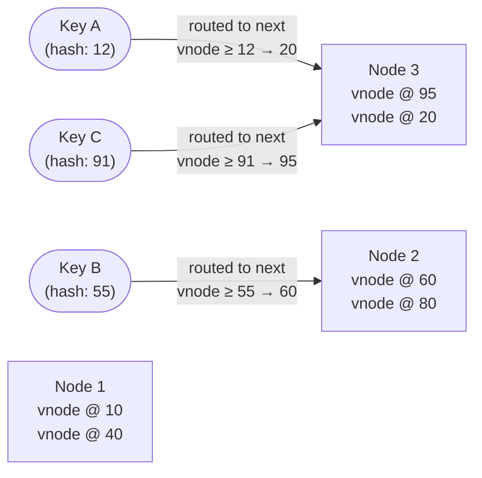

These recur across designs. Recognizing when to reach for one is a senior signal.

- **Full-text search — the inverted index:** map each term → list of documents containing it (the inverse of a document → its words). This is how search engines answer "which docs contain X" instantly. **Elasticsearch** (built on Lucene) is the go-to. Use it alongside your primary DB, not instead of it.
- **Geospatial indexing:** to answer "what's near me," ordinary indexes don't work in 2D. **Geohash** encodes lat/long into a string where shared prefixes mean physical proximity. **Quadtrees** and **Google S2** recursively subdivide space. Powers Uber, Lyft, Yelp, "find nearby."
- **Unique ID generation at scale:** auto-increment IDs don't work across shards (and leak counts). Options: **UUID** (128-bit, random, no coordination, but big and unsortable), and **Snowflake** (a 64-bit ID = timestamp + machine ID + per-ms sequence number — roughly time-sortable, unique across machines, no central bottleneck). Snowflake-style is the common answer.
- **Probabilistic data structures** (trade a little accuracy for huge memory savings):
  - **Bloom filter:** "is X *possibly* in the set?" No false negatives, some false positives. "Definitely not present" or "maybe present." Used to avoid pointless DB/cache lookups.
  - **HyperLogLog:** estimate the count of *distinct* items (cardinality) in kilobytes instead of gigabytes. For "unique visitors" at scale.
  - **Count-min sketch:** estimate item *frequencies* in sublinear space. For "top-K" / heavy-hitter detection.
- **Notification systems & feed ranking:** fan-out delivery across channels (push/email/SMS) with retries and dedup; feeds may be **chronological** (simple) or **ranked** by a relevance model (complex, ML-driven).

## When to use what

Recognizing the component is half the answer. The other half is knowing exactly which problem it is solving.

| Component | The problem it solves | Canonical use case | What it does NOT solve |
|---|---|---|---|
| **Bloom filter** | "Is this key definitely absent?" — avoid a costly DB/cache round-trip | Check whether a URL has been crawled; avoid cache stampede for missing keys | Exact set membership; storing values; eliminating false positives |
| **Consistent hashing** | Adding/removing nodes without reshuffling all keys | Distributed cache (Memcached), sharded DB routing, CDN edge selection | Hot-key concentration (still need virtual nodes + per-key caching) |
| **Geohash / quadtree** | 2D proximity search ("find the nearest driver") | Ride-sharing, food delivery, "nearby" social features | Exact polygon containment; time-varying queries at sub-second freshness without additional care |
| **CDN** | Reduce origin load and serve static/cacheable content from the network edge | Images, JS/CSS, video segments, API responses with long TTLs | Dynamic, personalised, or uncacheable responses; real-time consistency |
| **Inverted index** | Full-text search — "which documents contain this term?" | Search engines, e-commerce product search, log search (Elasticsearch) | Exact-match lookups by primary key (that's just an index) |
| **Distributed lock (ZooKeeper / etcd)** | Mutual exclusion across processes on different machines | Leader election, preventing double-payment, exactly-once job scheduling | High-throughput coordination (locks do not scale horizontally; redesign to avoid them) |
| **Count-min sketch** | Estimate per-item frequencies in bounded memory | Top-K trending items, heavy-hitter detection, rate limiting by IP | Exact counts; membership tests (use Bloom filter instead) |

## Numbers worth knowing

:::note
**Bloom filter sizing:** to achieve a 1% false-positive rate, you need roughly **9.6 bits per element**. A filter for 100M elements costs ~120 MB — trivial compared to the DB round-trips it avoids. At 0.1% false-positive rate, budget ~14.4 bits per element (~180 MB for 100M elements).

**CDN cache-hit ratios:** well-configured CDNs achieve 85–99% cache-hit ratios for static assets. Even a 90% hit ratio means your origin receives only 10× less traffic. Miss-handling (origin shield) and TTL tuning are the main levers.

**Inverted index basics:** an index over 1B documents with average 200 terms/doc generates ~200B postings. Compressed with delta-encoding and variable-length integers, this fits in a few hundred GB — searchable in milliseconds with skip lists and WAND scoring.

**Consistent hashing + virtual nodes:** with 150 virtual nodes per physical node, the standard deviation of key distribution across nodes is under 10%. Without virtual nodes, one node commonly ends up holding 2–3× the share of another.
:::

## Common pitfalls

- **Expecting a Bloom filter to have no false positives.** A Bloom filter guarantees *no false negatives* (if it says "absent," the element is definitely absent), but it *always has some false positives* (it may say "present" for an element that was never added). Failing to account for this leads to incorrect "already processed" logic. Size the filter and calibrate the false-positive rate explicitly.
- **Using a relational B-tree index for 2D proximity.** A standard index on `(latitude, longitude)` is useless for "find all points within 5 km" — it cannot satisfy a 2D range query. Use a geospatial index (PostGIS, geohash prefix matching, quadtree) from the start. Retrofitting is painful.
- **Leaning on distributed locks as a primary coordination mechanism.** Distributed locks are expensive (network round-trips, lock contention) and fragile (the lock holder can crash holding the lock). They are appropriate for rare mutual exclusion (leader election, payment idempotency), not for coordinating every write. Redesign using idempotency keys, CAS operations, or event-driven patterns instead.
- **Ignoring CDN cache invalidation complexity.** Updating cached content is not instantaneous. A stale CDN layer can serve wrong prices, deleted content, or revoked access for minutes after your origin updates. Design TTLs conservatively for mutable content; use versioned URLs (`/static/app.v3.js`) for immutable assets; and have a plan for emergency purges.
- **Treating consistent hashing as a solution to hot keys.** Consistent hashing distributes keys evenly *on average*, but a single viral key (`celebrity_user_id`, `trending_item`) still concentrates all traffic on one node. You still need per-key caching, key salting, or fan-out mitigation on top.
- **Using HyperLogLog or Count-min sketch without understanding error bounds.** HyperLogLog has a ~0.81% standard error; Count-min sketch trades hash collisions for memory. Presenting these estimates as exact counts in product dashboards leads to confusion. Document the approximation and bound the error in your design.

## Worked example: "find nearby drivers" with consistent hashing + geohash

A ride-sharing backend must (a) store 10M driver locations updated every 4 seconds and (b) answer "find the 10 nearest available drivers to this pickup location" in under 50ms.

**Naive approach:** store all drivers in a SQL table with `(latitude, longitude)` and run `SELECT ... ORDER BY distance(lat, lon, ?, ?) LIMIT 10`. This is a full table scan — hopeless at scale.

**Better approach:**
1. **Geohash** each driver's location to precision 6 (each cell ≈ 1.2 km × 0.6 km). Store a Redis sorted set per geohash cell: `geo:{geohash} → {driver_id: score=last_seen_timestamp}`.
2. On a "find nearby" query, hash the pickup location, look up the matching cell and its 8 neighbours (geohash neighbour computation is O(1)), and union the results. Return the top-10 by actual Haversine distance.
3. **Consistent hashing** shards the Redis cluster by geohash prefix so that geographically adjacent cells land on the same shard — minimising cross-node fan-out for the neighbour query.

Result: the nearby query touches at most 3 Redis nodes (9 cells sharded by prefix), each returning a small set, all within a single async round-trip. p99 well under 50ms.

## Consistent hashing ring

