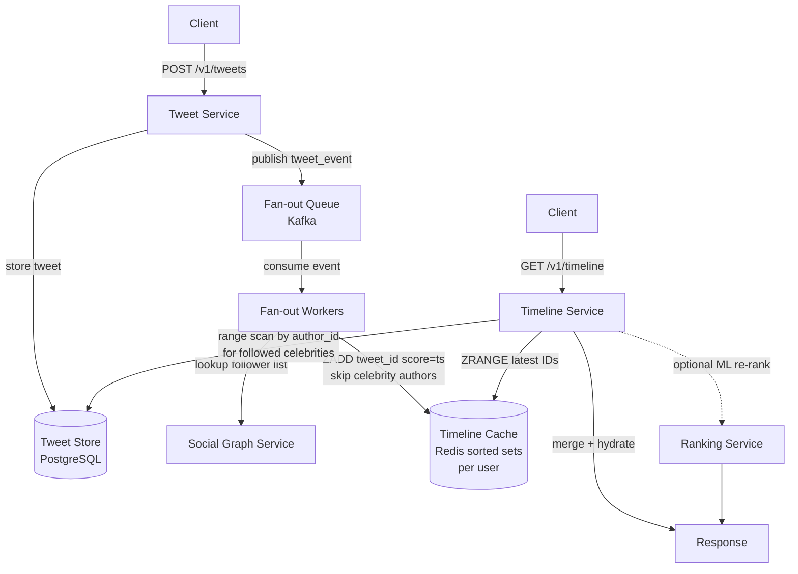

The most instructive system design problem, because it forces the single most important tradeoff in the field: **push vs pull (fan-out on write vs read).** The celebrity problem is not a corner case — it is the stress test that reveals which strategy you actually need. If you internalize one case study deeply, make it this one.

## 1. Requirements

*Functional:*
- Post a tweet (text + optional media).
- Follow and unfollow users.
- View a **home timeline**: the most recent posts from everyone you follow, served reverse-chronologically by default; optionally re-ranked by ML relevance.
- Like, retweet, reply — out of scope for depth; noted as natural extensions.

*Non-functional:*
- **Scale:** ~200M daily active users; write volume is vastly smaller than read volume.
- **Latency:** home timeline p99 < 300 ms; users notice a slow feed immediately.
- **Availability:** 99.99% — a broken feed is a visible product failure.
- **Consistency:** eventual consistency is acceptable. A tweet appearing one second late in a follower's feed is a non-issue. Prioritize availability and latency over strong consistency everywhere.

## 2. Estimation

**Write side:** 200M DAU × 2 posts/day = ~400M posts/day → ~4,600 tweets/s average, ~14,000 tweets/s at 3× peak.

**Read side:** reads dominate overwhelmingly. A DAU opens the app ~5–8 times per day; call it 1B timeline loads/day → ~11,600 timeline reads/s on average, higher at peak. **Read:write ratio ≈ 50–100:1.** The read path is the one that must be fast.

**Fan-out write amplification — the number that drives everything:** the average account has a few hundred followers. Naïve push (write every tweet into every follower's timeline cache immediately) → 400M posts/day × 300 avg followers = **120 billion timeline cache writes per day**, or ~1.4M writes/s. That is large but achievable for normal users. Now consider a celebrity with 100M followers: one tweet triggers **100M Redis writes in a single burst**. This one number makes the case for the hybrid strategy in §6.

**Storage:** each tweet record is small (~500 bytes — text, metadata, author ID). 400M × 500 B = ~200 GB/day of raw tweet data — trivial. Media goes to object storage; only the URL lives in the tweet record. The per-user timeline cache in Redis holds only tweet IDs: at 8 bytes/ID × 1,000 entries × 200M users ≈ **1.6 TB of Redis memory**, comfortably distributed across a sharded cluster.

## 3. API

```
# Write a tweet
POST /v1/tweets
Body: { text: string, media_ids?: string[] }
Returns: { tweet_id, created_at }

# Read the home timeline (cursor-based)
GET /v1/timeline?cursor=<opaque_string>&limit=20
Returns: { tweets: [TweetObject], next_cursor: <opaque_string>, has_more: bool }

# Social graph
POST   /v1/users/{user_id}/follow
DELETE /v1/users/{user_id}/follow

# Media upload (two-phase: get a pre-signed URL, then PUT directly to object storage)
POST /v1/media/upload-url
Returns: { upload_url, media_id }
```

`cursor` encodes the last-seen `tweet_id` and timestamp as an opaque string — the client treats it as a token. The server decodes it to issue an efficient range scan. Never use integer page offsets at this scale (see §6 — Pagination).

## 4. Data model & storage choice

Three distinct storage concerns, each with different access patterns and the right tool for each.

### Tweets

Write once, never updated (unless you add edit support — a notable complexity). Access patterns: point lookup by `tweet_id`; range scan by `(author_id, created_at DESC)` to get a user's own posts.

**PostgreSQL** with a compound index on `(author_id, created_at DESC)` handles this well at moderate scale. At very high scale, shard by `author_id` or move to a wide-column store (Cassandra) for write throughput. Media (images, video) goes to **object storage (S3-equivalent)** fronted by a **CDN**; the tweet record stores only `media_urls[]`.

```
tweets (
  tweet_id    BIGINT PRIMARY KEY,   -- Snowflake ID (timestamp in high bits)
  author_id   BIGINT NOT NULL,
  body        TEXT,
  media_urls  TEXT[],
  created_at  TIMESTAMP,
  like_count  INT,
  retweet_cnt INT
)
```

`tweet_id` as a [Snowflake ID](https://en.wikipedia.org/wiki/Snowflake_ID) encodes a millisecond-precision timestamp in its high bits — time-range queries become efficient index scans without a separate `created_at` index, and IDs sort naturally by creation time.

### Social graph

Maps follow relationships: "user A follows user B." Access patterns: "who does user A follow?" (fan-out lookup) and "who follows user B?" (follower list for fan-out write). Both directions are hot on the read path.

Store in **PostgreSQL** as a simple edges table indexed in both directions. A graph database is overkill here — you only need one-hop traversal. Read replicas absorb the heavy read load.

```
follows (
  follower_id  BIGINT,
  followee_id  BIGINT,
  created_at   TIMESTAMP,
  PRIMARY KEY (follower_id, followee_id)
)
-- reverse index: (followee_id, follower_id) for "who follows me?" lookups
```

### Timeline cache

Per-user **Redis sorted set** of recent tweet IDs, scored by creation timestamp. On a feed read, the Timeline Service fetches IDs from Redis, then bulk-fetches tweet bodies from the tweet store in a single multi-get. Storing only IDs keeps the per-user footprint small (~8 KB per user at 1,000 entries) and avoids invalidation problems when tweets are deleted or edited.

```
timeline:{user_id}  →  Redis sorted set of tweet_id
                        scored by tweet timestamp
                        capped at 800–1000 entries via ZREMRANGEBYRANK
```

[Caching](/building-blocks/caching/) strategy is **write-through on fan-out** (the Fan-out Service pushes into Redis when a tweet arrives) and **cache-aside on miss** (if the cache is cold or stale, the Timeline Service rebuilds from the tweet and social graph stores).

## 5. High-level design

Two paths: write and read.

**Write path:** client posts a tweet → Tweet Service stores the record in the Tweet Store → publishes a tweet event to the Fan-out Queue → Fan-out Workers consume the event, look up the author's follower list in the Social Graph Service, and write the new `tweet_id` into each follower's Timeline Cache (Redis sorted set). For accounts above the celebrity threshold, the Fan-out Worker skips this push entirely (see §6).

**Read path:** client requests the timeline → Timeline Service reads the user's prebuilt sorted set from Redis → for any celebrities the user follows, fetches those celebrities' recent tweets from the Tweet Store directly (a small per-author range scan) → merges both streams → sorts by timestamp (or hands off to the Ranking Service for ML re-ranking) → returns the top N entries hydrated with full tweet bodies.



:::note
Fan-out Workers skip celebrity authors entirely. The Timeline Service handles them at read time by pulling their recent posts from the Tweet Store and merging them with the user's pre-pushed timeline. This is the hybrid: **push for normal users, pull for celebrities, merge at the seam**.
:::

## 6. Deep dives

### Push (fan-out on write)

When a tweet is posted, immediately write the `tweet_id` into every follower's Timeline Cache.

**Pros:** timeline reads are instant — just read a prebuilt sorted set. No per-request fan-in computation. Works extremely well for the common case (users with hundreds of followers). The read path is a single Redis `ZRANGE` call plus a bulk-fetch of tweet bodies.

**Cons:** write amplification is linear in follower count. A user with 500 followers → 500 Redis writes per tweet — fine at average scale. But it does useless work for inactive users who may never open the app. And it completely breaks for celebrities.

### Pull (fan-out on read)

Build the timeline on demand: fetch the N most recent posts from each account the user follows, merge, and sort.

**Pros:** writes are cheap — just store the tweet once. No wasted work for celebrities or dormant followers. The feed is always maximally fresh.

**Cons:** every timeline load is expensive. For a user following 1,000 accounts, that is 1,000 fan-in reads, a merge sort over potentially thousands of results, and unpredictable latency that scales with follow count. **This is how early Twitter worked, and it repeatedly fell over.** The p99 latency is unacceptable at scale.

### The celebrity problem

A user with 100M followers posts. Under pure push, one tweet triggers **100M Redis writes in a burst**. Fan-out Worker queue depth spikes. Other users' timelines stall while workers spend all their capacity on one celebrity's fan-out. Write amplification is catastrophic and unpredictable — a single celebrity post can be an unplanned traffic event equivalent to a large DDoS on your own infrastructure.

This is not a hypothetical. Twitter's "fail whale" era was partly driven by fan-out storms from high-follower accounts.

### The hybrid (the real answer)

**Push for normal users, pull for celebrities, merge at read time.**

Define a threshold — accounts with more than, say, 1M followers are classified as "celebrities" (the exact cutoff is a tunable operational parameter; in practice it is often in the tens of thousands). Fan-out Workers skip these authors entirely. Instead:

- The Timeline Service tracks which celebrities each user follows (a small lookup in the Social Graph Service at read time).
- At read time it fetches each celebrity's recent posts from the Tweet Store — a small `author_id + timestamp` range scan — and merges them with the user's prebuilt pushed timeline.
- The merge is cheap: a user follows at most a handful of celebrities; fetching their last 50 posts and merging by timestamp is tens of comparisons.

:::tip
In an interview, don't wait to be prompted to the hybrid. Introduce the celebrity problem yourself: estimate the write amplification (100M followers × posts = hundreds of millions of writes per burst), show why pure push fails, explain why pure pull also fails, and propose the hybrid proactively. This signals you have thought about real failure modes, not just the happy path — and that is what separates a strong senior answer from a textbook one.
:::

**Why this synthesis is the senior-level signal:** you recognized that a single strategy does not fit the full user population, defined the failure mode precisely using numbers, and proposed a design that preserves push's read-time performance for normal accounts while bounding worst-case write amplification. The threshold is both a correctness decision and a backpressure valve.

### Ranking

Reverse-chronological is simple, transparent, and honest. An ML relevance ranking (like Twitter's current algorithm) boosts engagement but adds significant complexity: a separate Ranking Service, a feature pipeline, model inference, and personalization signals that must all complete within the latency budget. For the interview, acknowledge both options, name the tradeoff (user control and transparency vs engagement lift), and move on. The ranking algorithm is a product decision; the interesting systems problem is the read-merge pipeline that precedes it.

### Pagination with cursors, not offsets

`GET /v1/timeline?page=3&limit=20` breaks at scale in two ways:

1. **Performance:** offset-based pagination requires the database to scan and discard the first `page × limit` rows on every request — a full index scan to page 50 means discarding 1,000 rows, every time, for every user.
2. **Correctness:** if new tweets arrive while a user is scrolling, rows shift. You skip content or see the same tweet twice. This is the "page drift" problem.

**Cursor-based pagination** encodes the last-seen position — the `tweet_id` and timestamp of the final entry returned — as an opaque token. The next request uses this cursor to issue an efficient range scan: `WHERE tweet_id < :cursor_id ORDER BY tweet_id DESC LIMIT 20`. No offset scan. Stable under concurrent writes. This is how every major feed API works in production.

See [databases](/building-blocks/databases/) §partitioning for why offset scans become hot-shard disasters at high page depths.

### Media

Images and video are never stored in the tweet record or the timeline cache — only their URLs. Media lives in **object storage** (S3-equivalent) fronted by a **CDN**. The CDN serves media from edge nodes near the user, cutting latency and offloading origin bandwidth. A tweet's media array is metadata only: `[{ media_id, url, type, width, height }]`. The client loads media URLs in parallel with the text timeline, after the text is already rendering.

The two-phase upload flow (get a pre-signed PUT URL, upload directly to object storage from the client, then reference the `media_id` in the tweet) keeps media bytes off the Tweet Service entirely.

See [caching](/building-blocks/caching/) §CDN for the edge-caching model.

### Consistency

The timeline can be slightly stale. If a tweet takes 500 ms to appear in a follower's feed, that is imperceptible. We explicitly choose **availability and low latency over strict consistency** throughout:

- Fan-out is async (queue-based) — a brief propagation lag is acceptable.
- The Redis Timeline Cache can trail the authoritative tweet store — acceptable.
- The read path does not require a quorum read — serve from cache, do not wait for cross-replica agreement.

This is the AP choice from the CAP theorem: partition tolerance + availability, accepting eventual consistency. See [databases](/building-blocks/databases/) §replication for the replication-lag model.

## 7. Bottlenecks & scaling

### Fan-out worker backpressure

A viral post from a high-normal-follower account (say, 5M followers — below the celebrity threshold) enqueues 5M writes into Redis. Under a spike (breaking news, live events), the [Kafka](/building-blocks/messaging/) fan-out queue accumulates lag — workers cannot drain fast enough. Timeline freshness degrades: a tweet may take 5–30 seconds to appear in all follower feeds.

Mitigations:
- **Horizontal scaling of fan-out workers** — add more consumers to the Kafka consumer group; Kafka's consumer group protocol redistributes partitions automatically.
- **Priority lanes** — give low-follower posts a fast lane; high-follower posts (but below the celebrity threshold) a separate lane with a larger worker pool.
- **Lower the celebrity threshold dynamically** — under queue pressure, temporarily route more authors to pull-on-read. The hybrid threshold is an operational lever, not just a design decision.

### Hot timeline keys in Redis

A user who follows many high-posting accounts accumulates frequent writes to their `timeline:{user_id}` sorted set — many fan-out workers hitting the same Redis key. As a sorted set grows without a size cap, writes become increasingly expensive.

Mitigations: cap timelines at 800–1,000 entries via `ZREMRANGEBYRANK` after each `ZADD` (evict oldest entries automatically); distribute keys evenly across Redis Cluster shards by `user_id` hash; add a short-lived local in-process LRU cache on Timeline Service nodes to absorb repeated reads of the same hot timeline within a few seconds.

### Thundering herd on cold start

If the Timeline Cache for a user is cold — first login after a long absence, cache eviction, or a Redis shard restart — the cache miss triggers a full rebuild: traverse the social graph, fan-in recent posts from all followed accounts, re-sort. Under a rolling Redis restart or a large cache eviction event, thousands of rebuilds fire simultaneously, flooding the Tweet Store and Social Graph Service.

Mitigation: trigger cache rebuilds asynchronously and serve a degraded timeline (e.g., the user's own recent posts, or a generic trending feed) until the cache warms. Stagger TTLs with random jitter to prevent synchronized expiry. See [caching](/building-blocks/caching/) §thundering herd.

### Write amplification summary

| Strategy | Write cost per tweet | Read cost per timeline load |
|---|---|---|
| Pure push | O(followers) Redis writes | O(1) sorted set read |
| Pure pull | O(1) tweet write | O(followed accounts) fan-in reads |
| Hybrid | O(normal followers) push; celebrity authors free | O(1) Redis + O(followed celebrities) merge |

The hybrid bounds worst-case write amplification at the celebrity threshold (e.g., 1M writes/tweet max), regardless of total follower count. A 100M-follower celebrity triggers zero fan-out writes; all delivery is handled at read time. The threshold also acts as a configurable escape valve: lower it when workers are under pressure, raise it when capacity is available.

### SPOF / redundancy

| Component | Redundancy |
|---|---|
| Tweet Service | Stateless; N instances behind a load balancer |
| Fan-out Workers | Stateless Kafka consumers in a consumer group; add or remove nodes freely |
| Kafka (fan-out queue) | Replication factor 3; survives broker loss; consumer lag is observable via standard metrics |
| Redis Timeline Cache | Redis Cluster with replicas; shard by `user_id` hash; if a shard fails, Timeline Service falls back to on-demand pull from tweet + graph stores |
| Tweet Store (PostgreSQL) | Primary + read replicas; automated failover (Patroni or RDS); shard by `author_id` at extreme scale |
| Social Graph Store | Read-heavy; add read replicas aggressively; same failover model as tweet store |
| CDN (media) | Inherently distributed; geo-replicated; multiple CDN providers for origin failover |

**Fail-open on Redis:** if the Timeline Cache is unavailable, the Timeline Service degrades gracefully to on-demand pull (fan-in from the tweet and social graph stores) for affected users. The feed is slower but not absent. Durability of tweets — stored in PostgreSQL — is never at risk from a Redis failure. Redis is a cache, not the source of truth.
