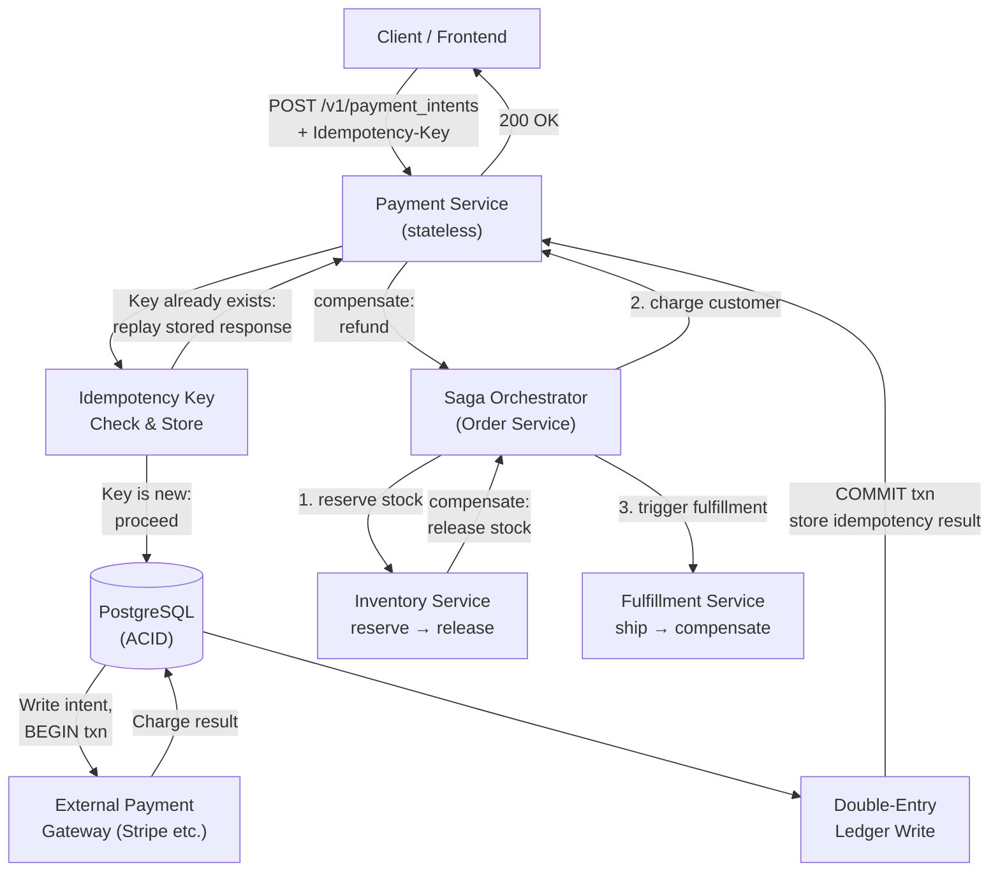

Payment systems are not a scale problem. They are a **correctness problem**. Double-charging a customer, silently losing a transaction, or settling the wrong amount are catastrophic failures that no amount of uptime compensates for. Every architectural decision here starts from that premise: when in doubt, refuse rather than risk a wrong balance.

## 1. Requirements

*Functional:*
- Charge a customer for an order (authorization + capture flow, or direct charge).
- Handle partial captures (authorize $100, capture $80 when the final amount is known).
- Process refunds — full or partial — against a settled charge.
- Integrate with an external payment gateway (Stripe, Braintree, Adyen) for card processing.
- Maintain an internal ledger recording every money movement for auditability.
- Support idempotent retries: a client can safely retry a failed or timed-out request without double-charging.

*Non-functional:*
- **Correctness first:** a payment must never execute twice, and money must never be created or destroyed — every debit has a matching credit.
- **Strong consistency and durability:** committed payment records must survive server failures, and all participants must agree on the outcome.
- **Auditability:** every mutation is an immutable, timestamped record. Nothing is ever deleted or updated in-place.
- **Availability:** design for fast recovery, but **prefer refusing a request over returning a wrong result** (CP, not AP).
- **Throughput:** modest by internet-scale standards. Even large e-commerce platforms process a few hundred to a few thousand payments per second at peak. This is not Twitter; it is a correctness-constrained OLTP workload.

## 2. Estimation

A large e-commerce platform at 500K orders/day → ~6 payments/second on average; ~30–50/s at peak (holiday spikes). Even a high-volume payments company like Stripe processes roughly a few thousand payment intents per second fleet-wide — orders of magnitude below the read QPS of a social feed.

Each payment-intent record: ~1–2 KB (metadata, amounts, status, timestamps). Each ledger entry: ~500 bytes. A ledger storing 5 years of records at 50 payments/s × 2 entries/payment × 500 bytes × 157M seconds ≈ **~80 GB** — trivially fits in a single well-provisioned relational database, let alone a replicated cluster.

The design constraint that matters is not throughput or storage — it is **write correctness under concurrent retries and partial failures**. The relevant question in estimation is: what is the idempotency key collision rate, and how quickly do payment-gateway round-trips need to complete? Gateway latency (200–800ms per call) sets the user-visible latency floor; everything else is dominated by that.

## 3. API

The external-facing API models a **payment intent** — a record of an attempt to charge, separate from the act of charging. This split is deliberate: it lets you create the intent (reserving the action) and capture it later when an order is confirmed.

```
POST /v1/payment_intents
Headers:
  Authorization: Bearer {api_key}
  Idempotency-Key: a8f3e2d1-7c4b-4f9a-b6e0-12c3d4e5f678   ← client-generated UUID

Body:
{
  "amount":      4999,          // in cents (USD 49.99)
  "currency":    "usd",
  "payment_method_id": "pm_1abc...",
  "capture_method": "automatic" // or "manual" for auth-only
}

Response 200:
{
  "id":       "pi_2xyz...",
  "status":   "succeeded",      // created | requires_capture | processing | succeeded | failed
  "amount":   4999,
  "currency": "usd",
  "created":  1717200000
}
```

```
POST /v1/payment_intents/{id}/capture        ← partial or full capture
  Body: { "amount_to_capture": 3999 }        // partial capture: $39.99 of a $49.99 auth

POST /v1/payment_intents/{id}/refund
  Headers: Idempotency-Key: {unique-key}
  Body: { "amount": 1999 }                   // partial refund: $19.99
```

The `Idempotency-Key` header is required on all mutating calls. The server maps it to a stored result, so a retry of a timed-out request returns the original response rather than running the charge again.

## 4. Data model & storage choice

### Why a relational database (CP)

Payment data is structured, transactional, and relational by nature. The ACID guarantees of PostgreSQL (or MySQL) are not a nice-to-have — they are the mechanism by which correctness is enforced. A failed mid-transaction write must roll back atomically; concurrent charges against the same account must be serialized; a crash between "call gateway" and "write result" must not leave the system in an ambiguous state.

This is a textbook **CP system**. See [Consistency, CAP & Correctness](/mindset/consistency-cap/): when correctness is non-negotiable, you choose consistency over availability. A payment system should **return an error** to the user rather than silently process a charge it cannot durably record.

### Tables

**`payment_intents`** — one row per payment attempt, updated (status transitions) as the payment progresses.

```sql
payment_intents (
  id              UUID PRIMARY KEY,
  amount          BIGINT NOT NULL,          -- in smallest currency unit (cents)
  currency        CHAR(3) NOT NULL,
  status          TEXT NOT NULL,            -- created | requires_capture | processing
                                            -- | succeeded | failed | canceled
  payment_method  TEXT,
  gateway_charge_id TEXT,                   -- external gateway's charge ID
  created_at      TIMESTAMPTZ NOT NULL DEFAULT now(),
  updated_at      TIMESTAMPTZ NOT NULL DEFAULT now()
)
```

**`ledger_entries`** — the **double-entry, append-only ledger**. Every money movement records two rows: a debit and a credit that balance to zero. Rows are never updated or deleted — reversals are new entries.

```sql
ledger_entries (
  id              UUID PRIMARY KEY,
  payment_intent_id UUID REFERENCES payment_intents(id),
  entry_type      TEXT NOT NULL,   -- debit | credit
  account         TEXT NOT NULL,   -- e.g. "customer:cus_abc", "revenue", "refunds_payable"
  amount          BIGINT NOT NULL, -- always positive; direction encoded by entry_type
  currency        CHAR(3) NOT NULL,
  description     TEXT,
  created_at      TIMESTAMPTZ NOT NULL DEFAULT now()
  -- No UPDATE. No DELETE. Ever.
)
```

A charge creates: debit `customer:cus_abc` $49.99 + credit `revenue` $49.99. A refund creates: debit `revenue` $19.99 + credit `customer:cus_abc` $19.99. The ledger never lies; its running sum is the source of truth for every account balance.

**`idempotency_keys`** — maps a client's `Idempotency-Key` to the stored result so retries are safe.

```sql
idempotency_keys (
  key             TEXT PRIMARY KEY,         -- the client-supplied header value
  api_endpoint    TEXT NOT NULL,            -- /v1/payment_intents etc.
  request_hash    TEXT NOT NULL,            -- SHA-256 of the request body
  response_status INT NOT NULL,             -- HTTP status of the original response
  response_body   JSONB NOT NULL,           -- the full response, replayed on retry
  created_at      TIMESTAMPTZ NOT NULL DEFAULT now(),
  expires_at      TIMESTAMPTZ NOT NULL      -- TTL: e.g. 24 h or 7 days
)
```

If a retry arrives with the same key but a different `request_hash` (the client is trying to reuse the key for a different request), return HTTP 422 — this is a client bug.

### Storage sizing and indexing

Index `payment_intents(gateway_charge_id)` for reconciliation lookups. Index `ledger_entries(payment_intent_id, created_at)` for account history. Partition `ledger_entries` by month if the table grows large. Retain `idempotency_keys` with a TTL enforced by a background sweep.

## 5. High-level design



The **Payment Service** is stateless and horizontally scalable. All state lives in PostgreSQL. The sequence on a new charge:

1. Check the `idempotency_keys` table. If the key exists, return the stored response immediately — no gateway call, no ledger write.
2. Write a `payment_intents` row with `status = processing` inside a transaction.
3. Call the external gateway. This is the only step that is **not** inside a DB transaction — network calls must not hold DB locks.
4. On gateway response (success or failure), open a DB transaction to: update the intent status, write the paired ledger entries, and insert the idempotency-key result. Commit atomically.
5. Return the response to the caller.

If step 3 times out and the client retries with the same idempotency key, step 1 either finds a committed result (return it) or finds no result (the original write in step 2 rolled back or was not reached). Either way, the gateway is called exactly once per logical charge.

The **Saga Orchestrator** coordinates the multi-service order flow. Each step is independently durable, and each step has a compensating action invoked on failure (see Deep Dive: Saga pattern below).

## 6. Deep dives

### (a) Idempotency keys

Networks are unreliable. A client sends a charge request; the gateway call succeeds; the server crashes before returning the response. The client's timeout fires and it retries. Without idempotency, the customer is charged twice.

The solution: the **client generates a unique key** (a V4 UUID) per logical operation and includes it in every request. The server's contract is: for any given key, the outcome is always the same, regardless of how many times the request is received.

Implementation: before doing any real work, insert the key into `idempotency_keys` (or read it if it already exists). Use a `SELECT FOR UPDATE` or an `INSERT ... ON CONFLICT DO NOTHING` followed by a read to avoid a TOCTOU race between two concurrent retries with the same key. Only the "winning" request proceeds; the other waits and then reads the result from the table.

Key expiry matters: idempotency keys should expire after a reasonable window (24 hours to 7 days). After that, a retry is treated as a new request — but realistic retry loops finish within seconds.

:::note[In the real world]
Stripe's idempotency-key implementation is the industry reference. Clients pass a unique string (e.g. a V4 UUID) as the `Idempotency-Key` header; Stripe stores the result and replays it on any retry, so a POST that times out can be safely retried without risk of double-charging. All POST endpoints accept idempotency keys. See [Designing robust and predictable APIs with idempotency](https://stripe.com/blog/idempotency) and the [Stripe idempotent requests docs](https://docs.stripe.com/api/idempotent_requests) for the full contract, including how key-request mismatches are handled.
:::

### (b) Double-entry ledger

A double-entry ledger is the accounting primitive that makes financial systems auditable and mathematically verifiable. Every transaction creates at least two entries — a debit and a credit — that sum to zero. If the sum of all ledger entries for any account equals zero, the books are balanced. If it does not, there is a bug.

The ledger is **append-only**. Rows are never updated or deleted. A refund is not an update to the original charge row — it is two new ledger entries that reverse the original two entries. This means:
- Any balance can be computed by summing all entries for an account from the beginning of time.
- Any historical state can be reproduced by scanning entries up to a given timestamp.
- A bug or fraudulent mutation is detectable: it either creates an unbalanced entry or is visible as an append in the audit log.

This property — immutability plus double-entry balance — is why traditional financial systems still run on relational databases. It maps naturally to ACID transactions (the two entries of a single payment are committed atomically or not at all) and to SQL aggregation queries for reporting.

### (c) Exactly-once vs at-least-once delivery

Networks give you at-least-once delivery: a request may be received zero or more times, never guaranteed exactly once. Idempotency keys are the mechanism that converts at-least-once network delivery into exactly-once *effect*.

The combination is: the ledger gives you **exactly-once writes** (an idempotency key maps to exactly one set of ledger entries); the gateway integration gives you **exactly-once charges** (the idempotency key is also forwarded to the gateway in the outbound call, so even the external charge is deduplicated). Stripe, Adyen, and most modern gateways support server-side idempotency for outbound API calls — pass the same key and you get the same charge result back even if the gateway processed it on the first call.

See [Reliability & Fault Tolerance](/building-blocks/reliability/) for the broader pattern of designing around at-least-once semantics.

### (d) Saga pattern and compensating transactions

Distributed ACID across multiple services is impractical. Two-phase commit (2PC) requires a coordinator that holds locks across services until all participants confirm — this is a latency, availability, and complexity disaster. A single slow or crashed service blocks the entire transaction.

The alternative is the **Saga pattern**: decompose a multi-step business transaction into a sequence of local transactions, each scoped to one service, each with a defined **compensating transaction** that undoes its effect if a later step fails.

For an order checkout:

| Step | Forward action | Compensating action |
|---|---|---|
| 1 | Reserve inventory | Release reservation |
| 2 | Charge customer (Payment Service) | Refund the charge |
| 3 | Trigger fulfillment | Cancel shipment |

If step 3 fails (fulfillment system is down), the orchestrator executes compensations in reverse: cancel the shipment attempt, refund the charge, release the inventory reservation. The customer is made whole without any cross-service distributed lock.

The key tradeoff: sagas are **eventually consistent** across services. There is a window between step 2 succeeding and step 3 failing where the customer has been charged and no shipment exists. The compensation closes that window, but it is not instantaneous. For payments, compensating a charge is a refund — a real, durable operation, not a rollback. Design compensations to be idempotent for the same reason as the forward operations.

## 7. Bottlenecks & scaling

### Ledger write contention

At high volume, many concurrent writes to `ledger_entries` for the same account could create hot rows. In practice, a relational database handles thousands of inserts per second on a single table without issue at payment-system QPS. If a genuinely high-volume merchant account creates contention, partition the ledger by `account` or by time range, and use connection pooling (PgBouncer) to reduce the overhead of connection management under burst load.

### Payment gateway latency and failure

The external gateway call (200–800ms typical, up to 30s on timeout) is the dominant source of end-to-end latency. Mitigations:

- **Timeout aggressively** on the client side (e.g., 10s hard timeout) and treat a timeout as an unknown outcome — not a failure. The retry with the same idempotency key resolves the ambiguity.
- **Retry with exponential backoff** for transient gateway errors (5xx). Do not retry 4xx (client errors — bad card number, insufficient funds).
- **Circuit breaker** on the gateway client: if the gateway is returning sustained errors, stop sending requests for a short window rather than letting threads pile up waiting for timeouts. See [Reliability & Fault Tolerance](/building-blocks/reliability/).
- **Multi-gateway fallback:** large systems route to a secondary gateway when the primary is degraded. Requires careful idempotency key management to avoid cross-gateway duplicates.

### Reconciliation

The internal ledger and the external gateway's records will occasionally diverge — a gateway charge that succeeded but whose response was lost before being written to the ledger, or a refund that the gateway processed but the internal system did not record. **Reconciliation** is a background job that:

1. Fetches the list of charges/refunds from the gateway for a time window.
2. Joins against the local ledger for the same window.
3. Flags discrepancies for manual or automated resolution.

Reconciliation is a control, not a fix — the goal is to detect drift, not to hide it. Run it at least daily; run it hourly for high-volume systems.

### SPOF / redundancy table

| Component | Failure mode | Mitigation |
|---|---|---|
| Payment Service (stateless) | Instance crash | Multiple instances behind a load balancer; no instance-local state |
| PostgreSQL (primary) | Primary failure | Synchronous streaming replica; automated failover (Patroni, AWS RDS Multi-AZ); RPO ≈ 0 |
| PostgreSQL (replica) | Replica lag | Writes always go to primary; replica lag only affects read replicas used for reporting |
| Idempotency key table | Slow lookup under load | Index on `key`; connection pooling; cache hot recent keys in Redis (with short TTL) |
| External gateway | Outage | Circuit breaker; retry; optional secondary gateway; surface degraded status to users |
| Saga orchestrator | Crash mid-saga | Persist saga state to the DB; on restart, resume from the last committed step |

**The CP stance is non-negotiable.** If the primary database is unavailable, the Payment Service should return an error to the caller — not attempt to charge based on cached or stale state. A brief outage is recoverable; a double charge or a lost transaction may not be. This is the correct failure mode for a system where correctness is the invariant.

For the theory behind this choice, see [Consistency, CAP & Correctness](/mindset/consistency-cap/) and [practice problems](/case-studies/practice-problems/) for variations on this design.
