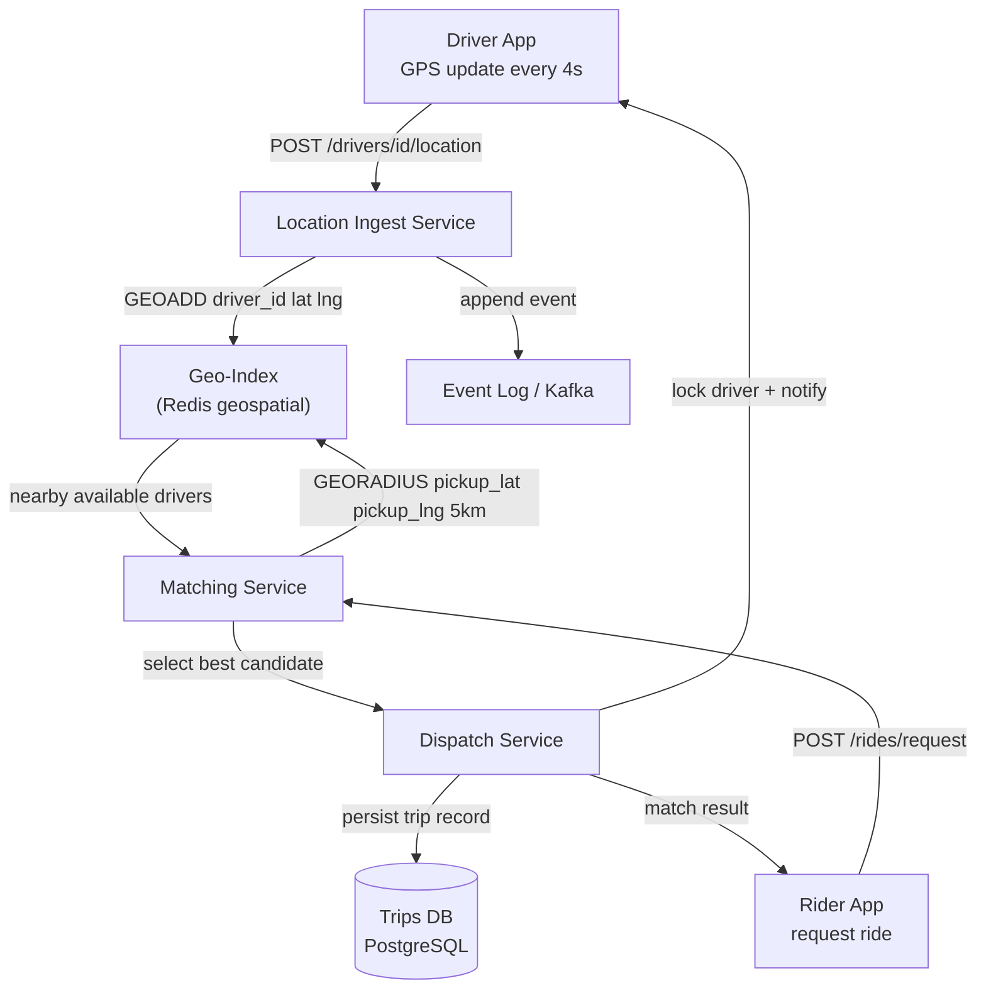

Ride-sharing is the canonical geospatial design problem. The core challenge is answering "which drivers are within X km of this rider right now?" thousands of times per second, against a location dataset that is rewritten every few seconds by millions of moving drivers. A conventional B-tree index cannot answer 2D proximity queries efficiently — the design pivots on choosing the right spatial data structure and keeping it in memory.

## 1. Requirements

*Functional:*
- Drivers stream their GPS location to the platform continuously (every ~4–5 s).
- Riders request a ride from a given pickup location; the platform matches them to a nearby available driver.
- Matched driver receives a dispatch (pickup address, rider info); rider receives ETA and driver identity.
- Driver and rider can track each other in real time during the trip.
- Trip record is persisted on completion for billing and history.
- ETA calculation and surge pricing — noted as extensions, not designed in depth here.

*Non-functional:*
- **Matching latency:** a ride request should be matched in < 1–2 s end-to-end.
- **Location write throughput:** millions of concurrent drivers each updating every 4 s → millions of writes per second; this is the dominant scaling constraint.
- **High availability:** 99.99% — a platform that is down loses rides and driver earnings immediately.
- **Eventual consistency:** a driver's displayed location can lag by one update cycle (4–5 s); this is acceptable.
- **Regional scale:** the system partitions naturally by geography; design for a single region, then note that regions are replicated globally.

## 2. Estimation

**Active drivers and location-update QPS:**

Assume 5 million active drivers globally at peak, 1 million in a single large region. Each driver updates location every 4 s:

```
1,000,000 drivers ÷ 4 s = 250,000 location writes/second per region
```

Globally across all regions: ~1.25 million location writes/second. This is the write firehose that dominates infrastructure sizing — not ride requests, not queries.

**Ride request QPS:**

Assume ~500,000 ride completions/hour at peak:

```
500,000 rides/hour ÷ 3,600 s ≈ ~140 ride requests/second
```

Ride request QPS is modest; the hard problem is sustaining the location write volume and keeping the geospatial index current.

**Location data size in memory:**

Each driver's current location: driver ID (8 bytes) + lat (8 bytes) + lng (8 bytes) + status (1 byte) + geohash cell key (~8 bytes) ≈ ~40 bytes.

```
1,000,000 drivers × 40 bytes = ~40 MB
```

The entire current-location dataset for one region fits easily in a single in-memory store. Historical location (for replay, billing disputes) goes to durable storage separately.

## 3. API

```
-- Driver streams location (called every ~4 s by the driver app)
POST /v1/drivers/{driver_id}/location
{
  "lat": 37.7749,
  "lng": -122.4194,
  "heading": 270,
  "speed_kmh": 32,
  "status": "available" | "on_trip" | "offline"
}
→ 204 No Content

-- Rider requests a ride
POST /v1/rides/request
{
  "rider_id": "uuid",
  "pickup": { "lat": 37.7800, "lng": -122.4100 },
  "dropoff": { "lat": 37.7500, "lng": -122.4050 }
}
→ 202 Accepted
{
  "ride_id": "uuid",
  "status": "matching",
  "poll_url": "/v1/rides/{ride_id}"
}

-- Poll / long-poll for match result
GET /v1/rides/{ride_id}
→ 200 OK
{
  "status": "matched",
  "driver": { "id": "uuid", "name": "Ana", "vehicle": "Toyota Camry", "plate": "ABC-1234" },
  "eta_seconds": 180,
  "driver_location": { "lat": 37.7795, "lng": -122.4115 }
}
```

The location endpoint is the high-frequency write path — it must be extremely cheap. The ride-request endpoint initiates an async matching flow; the client polls (or receives a push over a WebSocket / server-sent event) for the result.

## 4. Data model & storage choice

### Why a regular index fails for proximity queries

A B-tree on `latitude` can find all drivers with `lat BETWEEN 37.77 AND 37.79`, but it cannot simultaneously constrain longitude — you still have to scan all rows in the latitude range and filter by longitude in a second pass. The more fundamental problem: **geographic proximity is a 2D concept; a 1D sorted index cannot express it.** A geo-query on a naive relational index degrades to a full-range scan, which is O(n) with a large constant.

### Geospatial index: geohash / quadtree / H3

The correct data structure maps 2D space to a 1D representation where nearby locations share a common prefix or cell membership, enabling efficient range lookups.

| Approach | Encoding | Proximity query | Density adaptation |
|---|---|---|---|
| **Geohash** | lat/lng encoded to a base-32 string; shared prefix = physical proximity | Prefix query on string index; check 8 neighboring cells to avoid edge artifacts | Fixed cell size per precision level |
| **Quadtree** | Recursively subdivide a 2D bounding box into four quadrants until a cell has ≤ N points | Tree traversal to the leaf cells covering the search radius | Yes — dense areas get finer subdivisions |
| **H3 (hexagonal grid)** | Earth tiled with hexagons at multiple resolutions; each cell has a 64-bit integer ID | Look up cells within radius k of the center cell | Fixed at each resolution, but multi-resolution |

**Chosen approach for this design:** a geohash-based in-memory index in Redis (via Redis's native geospatial commands: `GEOADD`, `GEORADIUS`). This is operationally simple, matches Redis's strengths, and handles the update rate comfortably. The quadtree is a better fit when cell-density variance matters deeply (sparse rural vs dense downtown); for a deployment at Uber's scale, Uber built H3 (see aside below).

### Storage layout

| Data | Store | Reason |
|---|---|---|
| Current driver locations + geo-index | Redis (in-memory, geospatial sorted set) | Sub-millisecond proximity queries; rewritten every 4 s; 40 MB fits in RAM |
| Driver/rider profiles, vehicle metadata | PostgreSQL | Relational, read-heavy, small; ACID for account mutations |
| Trips (in-progress and completed) | PostgreSQL + async archive to columnar store | Durable, transactional; billing requires ACID; analytics queries go to the archive |
| Trip events / location history | Cassandra or time-series store | High write throughput, time-partitioned, append-only; no random updates |

:::note[In the real world]
Uber built and open-sourced **H3**, a hexagonal hierarchical geospatial indexing system, to index locations into cells for driver matching, surge pricing, and analytics. Hexagons have a key property that squares do not: **every neighbor of a hexagon is equidistant from its center**, which means a radius query touches the same number of cells in every direction and avoids the diagonal-corner distortion of square grids. H3 supports 15 resolution levels; Uber typically uses resolution 9 (~0.1 km² cells) for matching and coarser resolutions for pricing zones.
Sources: [H3: Uber's Hexagonal Hierarchical Spatial Index](https://www.uber.com/en-US/blog/h3/) and the [uber/h3 project](https://github.com/uber/h3).
:::

## 5. High-level design



**Location ingest path:** the driver app POSTs to the Location Ingest Service, which updates the driver's entry in the Redis geo-index (`GEOADD`) and also publishes the raw event to Kafka for downstream consumers (analytics, location history, ETA engines). The Redis write is the hot path — it is the one that must sustain 250K ops/second.

**Match path:** when a rider requests a ride, the Matching Service calls `GEORADIUS` (or the newer `GEOSEARCH`) on Redis to find available drivers within a configurable radius (e.g., 5 km). It scores candidates (distance, acceptance rate, trip direction alignment) and forwards the top candidate to the Dispatch Service. The Dispatch Service sends the offer to the driver app and awaits acceptance. If the driver declines or does not respond within ~15 s, the Matching Service advances to the next candidate.

See [Specialized Components](/building-blocks/specialized-components/) for more on geospatial indexing, and [Messaging & Async](/building-blocks/messaging/) for the Kafka event log pattern.

## 6. Deep dives

### (a) Geospatial indexing in depth

**Geohash:** encodes a latitude/longitude pair into a base-32 string (e.g., `9q8yy` for San Francisco). The key property: **the longer the shared prefix, the closer the physical locations.** Drivers in `9q8yy` are near drivers in `9q8yz`. A proximity query becomes a prefix scan or a lookup of the cell plus its 8 neighbors (N, NE, E, SE, S, SW, W, NW). The edge problem is that two locations can be physically adjacent but have no shared prefix if they sit on a cell boundary — this is why you always query the 8 neighbors, not just the target cell.

Redis's geo commands internally use a geohash stored in a sorted set (the score is the geohash integer encoding). `GEOSEARCH` returns members within a radius or bounding box with sub-millisecond latency up to millions of entries.

**Quadtree:** recursively divides a 2D bounding box into four equal quadrants. A leaf node holds up to a configurable number of points (e.g., 50 drivers); if a cell overflows, it splits. This naturally adapts to density: a dense downtown area gets many fine-grained cells; rural areas stay coarse. The tradeoff is a more complex update path (inserting or moving a driver may cause a split or merge) and that the tree lives in application memory, requiring care around concurrent updates.

**H3 hexagonal grid:** each hexagon has exactly six equidistant neighbors, making k-ring neighbor lookups perfectly uniform. There is no diagonal penalty. H3 cells are identified by a 64-bit integer, making indexing and partitioning easy. The limitation: hexagons do not tile perfectly at every resolution boundary, so cross-resolution queries require care.

**Rule of thumb:** geohash for simplicity and Redis integration; quadtree when you need density-adaptive cells in application memory; H3 when uniformity of adjacency and multi-resolution analytics matter.

### (b) High-frequency location ingest

250,000 writes/second to Redis is well within Redis's throughput ceiling (~1M simple ops/second per node), but the design must avoid unnecessary work:

- **Write only to Redis, not to a relational DB per update.** The relational database cannot sustain this write rate for current-location updates. Redis is the live index; the relational DB holds trip state.
- **Overwrite, not append.** Each `GEOADD` call simply overwrites the driver's position — the geo-index holds only the most recent location. Historical location events flow to Kafka and eventually to Cassandra or a time-series store, but that path is asynchronous and does not block the hot path.
- **Redis cluster sharding by geography.** Shard the geo-index by region prefix (e.g., one Redis shard per city or geographic zone). This distributes the 250K writes/second across multiple shards and also aligns with the natural partitioning of matching (a rider in San Francisco only cares about drivers in San Francisco).
- **Connection pooling.** The Location Ingest Service maintains a persistent connection pool to Redis. At 250K writes/second across ~20 ingest service instances, each instance issues ~12,500 writes/second — easily handled with pipelining.

### (c) The dispatch race: preventing double-assignment

Two riders submit ride requests within milliseconds of each other. Both queries return the same nearby driver as the best candidate. Both dispatch attempts race to assign the same driver to two different riders. Without coordination, the driver receives two simultaneous offers and one rider ends up unmatched.

**Solutions in increasing complexity:**

1. **Optimistic locking with a version field:** the driver record in PostgreSQL includes a `version` column. The Dispatch Service does `UPDATE drivers SET status='dispatched', version=version+1 WHERE id=? AND status='available' AND version=?`. Only one update succeeds (the other sees a version mismatch and retries with the next candidate). Simple and correct; adds a round-trip to PostgreSQL per dispatch attempt.

2. **Short reservation in Redis:** before dispatching, the Dispatch Service attempts `SET dispatch_lock:{driver_id} {ride_id} NX EX 30` (set if not exists, expire in 30 s). Only the first request acquires the lock; the second fails and advances to the next candidate. Faster than a PostgreSQL round-trip. The lock expires automatically if the dispatch flow crashes without releasing it.

3. **Serialized dispatch queue:** all dispatch attempts for the same driver go through a single queue (e.g., a Kafka partition keyed by `driver_id`). A single consumer processes them serially, eliminating the race entirely at the cost of higher latency and added infrastructure.

**Chosen design:** Redis `SET NX EX` reservation (option 2) for speed, with optimistic locking in PostgreSQL as the durable fallback. The Redis lock is a soft reservation; the PostgreSQL update is the authoritative state change.

### (d) Supply/demand and surge pricing (extension)

Surge pricing aggregates ride requests and available drivers within a geographic zone over a rolling window. The same geo-index and Kafka event stream feed a separate Surge Service that computes supply/demand ratios per zone and adjusts pricing multipliers. This is read-only relative to the matching path and runs on a slightly stale snapshot (acceptable for pricing).

## 7. Bottlenecks & scaling

### Hot cells: dense urban areas

A busy downtown area (Times Square, the Loop) may have thousands of drivers and hundreds of simultaneous ride requests within a single small geohash cell. This concentrates both location writes and proximity queries on a small set of Redis keys.

Mitigations:
- **Finer cells for dense areas:** use a higher-precision geohash (more characters = smaller cell) in known hot zones so load is spread across more keys.
- **Geographic sharding:** split the Redis geo-index so that hot cities get their own dedicated Redis cluster, rather than sharing with low-traffic regions.
- **Read replicas:** the geo-index is written by the ingest service but read by the matching service. A Redis replica can serve `GEOSEARCH` read traffic, isolating read and write load.

### Location write storm

A sudden spike in active drivers (commute rush, event end) can push location ingest above steady-state estimates. Mitigations:
- **Ingest tier autoscaling:** the Location Ingest Service is stateless and scales horizontally behind a load balancer.
- **Write coalescing:** if a driver sends updates faster than the configured 4-second interval (e.g., on a bumpy connection causing retries), the ingest service deduplicates by `(driver_id, timestamp)` and drops older events for the same driver within the same second.
- **Kafka as a buffer:** the async Kafka write absorbs spikes for downstream consumers; only the Redis write is synchronous and latency-sensitive.

### Matching contention

At high rider-request QPS, many parallel `GEOSEARCH` calls hit the same Redis shards. Redis is single-threaded per shard, so a slow or expensive `GEOSEARCH` (e.g., large radius in a dense city) can block other operations.

Mitigations:
- **Bound the search radius.** Start with a small radius (e.g., 2 km) and expand only if no drivers are found. This keeps most queries cheap.
- **Cap result set.** Request only the top N closest drivers (e.g., N=10); ranking and selection happen in the Matching Service, not Redis.
- **Read replicas** absorb query load as above.

### SPOF and redundancy

| Component | Redundancy |
|---|---|
| Location Ingest Service | Stateless, N instances; load-balanced; any instance can handle any driver |
| Redis geo-index | Redis Cluster with replicas; if a primary shard fails, a replica is promoted; brief failover window uses stale data |
| Kafka event log | Replication factor 3; consumer groups replay on restart |
| Matching Service | Stateless, N instances |
| Dispatch Service | Stateless + Redis lock; lock TTL prevents permanent driver holds on crash |
| PostgreSQL (trips) | Primary + read replicas + automated failover (RDS Multi-AZ or Patroni) |
| Cassandra (location history) | Replication factor 3; quorum writes; survives node loss |

**Fail behavior on Redis geo-index loss:** if the Redis cluster is unavailable, the matching service cannot answer proximity queries and ride matching halts. This is a hard dependency — unlike the rate limiter (which can fail open), there is no safe fallback for "which driver is nearest." Mitigation: warm a standby Redis cluster from the Kafka location event stream; on primary failure, promote the standby. The standby may be a few seconds stale, which is acceptable given driver locations update every 4 s anyway.

---

For related patterns, see [Databases & Storage](/building-blocks/databases/) for the write-optimized vs read-optimized index tradeoff, [Specialized Components](/building-blocks/specialized-components/) for geospatial indexing and geohash vs quadtree, and [practice problems](/case-studies/practice-problems/) to test your recall.
