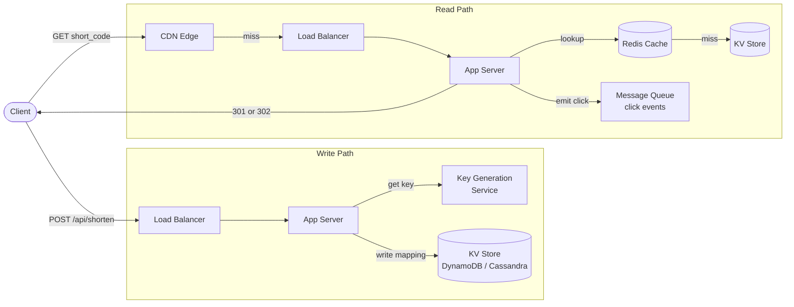

The canonical "learn the framework" problem — simple enough to finish in an hour, rich enough to touch key generation, redirect semantics, caching, analytics pipelines, and sharding. The real depth is in the choices you make after the first sketch.

## 1. Requirements

*Functional:*
- Given a long URL, create and return a unique short URL (system-generated short code; custom alias is an optional extension).
- Visiting the short URL redirects the browser to the original long URL.
- Optional expiration time per URL; expired links return 404 or 410 Gone.
- Optional: link analytics (click counts, referrers, geographic breakdown).

*Non-functional:*
- **Scale:** tens of millions of new short URLs per day; billions of redirects.
- **Read-heavy:** redirects outnumber creates ~100:1 — optimise the read path ruthlessly.
- **Availability:** 99.99% — a broken short link is immediately visible and erodes trust. A dead redirect is worse than a slow one.
- **Latency:** redirect p99 < 10 ms from cache; < 100 ms on a cache miss. Every added millisecond raises bounce rate.
- **Durability:** once a short code is issued it must resolve forever (or until explicit expiry). A mapping must never be lost.

:::caution
Availability matters more than strict consistency here. If two writes to the same short code race across regions, the safer resolution is last-write-wins rather than blocking the write path on global consensus.
:::

## 2. Estimation

Assume **100 M new URLs/day** as the write baseline.

| Metric | Calculation | Result |
|---|---|---|
| Write rate (avg) | 100 M / 86 400 s | ~1,160 writes/s |
| Read rate (avg, 100:1) | 1,160 × 100 | ~116,000 reads/s |
| Read rate (peak, 3×) | 116,000 × 3 | ~350,000 reads/s |
| Record size | short_code + long_url + metadata | ~500 B |
| Records over 5 years | 100 M/day × 365 × 5 | ~182 B records |
| Raw storage (5 yr) | 182 B × 500 B | **~91 TB** |

**What the numbers force:**
- A single machine cannot handle 350 K reads/s — distributed store and horizontal scaling required.
- 91 TB rules out anything that does not scale storage independently of compute.
- The 100:1 read skew makes [caching](/building-blocks/caching/) the single highest-leverage decision — a 99% cache hit rate drops KV store load from 350 K/s to 3,500/s.
- Globally distributed users mean a **CDN at the edge** is not optional for low-latency redirects worldwide.

## 3. API

```
# Create a short URL
POST /api/shorten
  Body:  { "long_url": "https://...", "custom_alias": "...", "expiry_seconds": 86400 }
  200:   { "short_url": "https://sho.rt/aB3xY9z" }
  409:   custom alias already taken

# Redirect
GET /{short_code}
  301 or 302  Location: <long_url>     (see §6 for the 301 vs 302 tradeoff)
  404         short code not found
  410         link has expired

# (Optional) Analytics
GET /api/links/{short_code}/stats
  200:  { "clicks": 14203, "created_at": "...", "top_referrers": [...] }
```

The redirect endpoint is the hot path. Everything else is secondary.

## 4. Data model & storage choice

The core record is minimal:

```
links (
  short_code   VARCHAR(10),   -- partition/primary key; the thing we look up
  long_url     TEXT,          -- the destination
  created_at   TIMESTAMP,
  expiry       TIMESTAMP,     -- NULL means no expiry
  owner_id     UUID           -- user who created it; NULL for anonymous
)
```

Access pattern: almost exclusively a **point lookup by `short_code`**. No joins, no complex queries, no ordering requirements. This is a textbook key-value workload.

**Storage choice:** a **key-value / wide-column store** (DynamoDB or Cassandra) keyed by `short_code` is the natural fit — both are horizontally scalable, offer single-digit-millisecond point reads, and handle the write throughput without the overhead of a relational engine. See [databases](/building-blocks/databases/) for the detailed tradeoffs.

A **sharded relational database** (PostgreSQL/MySQL with hash-partitioning on `short_code`) also works if your team already operates relational infrastructure — the access pattern is simple enough that you won't miss joins. The tradeoff is operational complexity of managing shards vs the managed scaling of DynamoDB.

:::note
Do not store analytics in the same table. Click events are an append-only time-series workload — exactly the wrong fit for a KV store tuned for point lookups. Separate them at the design stage.
:::

## 5. High-level design

Two distinct paths share the same infrastructure but must be optimised independently.

**Write path (create a short URL):**
1. Client POSTs to the load balancer → App server.
2. App server requests a unique short code from the Key Generation Service (KGS).
3. App writes `{ short_code → long_url, metadata }` to the KV store.
4. Returns `short_url` to client.

**Read path (redirect):**
1. Client GETs `/{short_code}` → CDN edge node. Hit → immediate redirect, done.
2. CDN miss → load balancer → App server.
3. App checks Redis cache. Hit → return redirect.
4. Cache miss → App queries KV store → populates cache → returns redirect.
5. App emits a click event to the message queue (async, never in the redirect response latency path).



The **CDN + Redis double-layer cache** is the reason the KV store doesn't melt. Most traffic never reaches it.

## 6. Deep dives

### Key generation

We need short codes that are unique, compact, and URL-safe. **Base62** (`a–z A–Z 0–9`) is the standard alphabet. At 7 characters: 62⁷ ≈ **3.5 trillion** combinations — enough for millennia of URLs at this scale.

Three strategies, with honest tradeoffs:

**Option A — Hash the long URL**
Take the first 7 characters of MD5 or SHA-256 of the URL, encode in Base62.

- Pro: deterministic — identical URLs naturally produce the same short code.
- Con: hash collisions require detection (check KV store, then retry with a different prefix). At billions of records, collision probability becomes non-trivial. The write path now needs a read-before-write, hurting write latency.
- Con: if the same URL is shortened twice, both return the same code — this may or may not be desirable (prevents duplicate entries, but breaks per-campaign tracking on the same destination URL).

**Option B — Counter + Base62**
Maintain a globally unique incrementing integer (Redis `INCR` or a Snowflake-style ID), encode it to Base62.

- Pro: no collisions by construction.
- Con: sequential IDs are guessable — an adversary can enumerate all URLs. Mitigate with a [Snowflake](https://en.wikipedia.org/wiki/Snowflake_ID)-style ID (mixes timestamp and machine bits, less sequential), or XOR/shuffle the bits before encoding.
- Con: the counter is a distributed bottleneck. A single Redis `INCR` handles ~100 K/s, which covers average load but may struggle at peak. Scale by having each app server claim a **range** (e.g., 1,000 IDs at a time from a coordinator such as ZooKeeper or a dedicated sequence service) and hand them out locally — only one network round-trip per 1,000 writes.

**Option C — Key Generation Service (KGS)**
Pre-generate a large pool of unique short codes offline, store them in a `keys_unused` table, and mark them `keys_used` when handed out. Each app server requests a key from KGS on each write.

- Pro: key lookup on the write path becomes a simple pop — no collision checks, no hashing, no coordination at write time.
- Pro: key uniqueness is guaranteed — the KGS manages the pool exclusively.
- Con: KGS is a new stateful service that needs its own high-availability story (see §7).
- Con: pre-generating every possible key (3.5 T × 7 bytes ≈ 24 TB) is impractical. In practice the KGS generates keys in large batches and keeps a buffer of ~10 M ready keys in memory.

**Recommended choice:** KGS or distributed counter + Base62 with range allocation. Both avoid collision checks on the write path. The KGS is conceptually cleaner; the counter approach requires fewer moving parts.

### 301 vs 302 redirect

This is a product decision disguised as a technical one:

| | **301 Permanent** | **302 Temporary** |
|---|---|---|
| Browser behaviour | Caches the redirect; future requests never reach your server | Asks your server every time |
| Server load | Very low after first visit | Full hit on every click |
| Click analytics | **Lost** — cached clicks don't reach you | **Full** — every click is visible |
| CDN cacheability | Highly cacheable (long `max-age`) | Shorter `max-age` or no-cache |

Choose 301 if minimising server load matters most (link-in-bio, static campaigns). Choose 302 if click analytics are a core feature (marketing platforms, A/B testing). Some services use 301 for verified-safe destinations but 302 while a new URL is still being scanned.

:::tip
If you want both low load and analytics, serve a 302 and push the click event to an async queue — you pay one server hop per click but redirect latency is still fast because the queue write is fire-and-forget, not in the response path.
:::

### Caching

Mappings are **immutable** — once `short_code → long_url` is written, it never changes (only expires). This makes caching unusually clean:

- **No invalidation problem.** The hardest part of caching — keeping the cache consistent after an update — simply does not apply here. Set the TTL to the mapping's expiry time (or a long TTL for non-expiring links) and never worry about staleness. This is a genuinely nice property; name it explicitly in an interview.
- Cache strategy: **cache-aside** with Redis. On a redirect, check Redis first; miss → KV store → populate Redis.
- Eviction: LRU. The working set of popular short codes is small — a few million hot links fit easily in a modest Redis cluster.
- Two-layer caching: CDN (geographic distribution, eliminates cross-ocean latency) + Redis (eliminates KV store round-trips). A viral short code served by the CDN never touches Redis or the KV store at all.

See [caching](/building-blocks/caching/) for the full treatment of these patterns.

### Analytics

**Never inline analytics in the redirect response.** The click pipeline should be invisible to the user:

1. When the app server handles a redirect, it **emits a lightweight click event** (short_code, timestamp, IP, referrer, user-agent) to a **message queue** (Kafka or SQS).
2. A separate **stream-processing consumer** (Flink, Kinesis Data Analytics, or a simple consumer group) reads from the queue and writes aggregated counts to an **analytics store** (ClickHouse, BigQuery, or Cassandra with a time-series schema).
3. The `GET /api/links/{short_code}/stats` endpoint reads from the analytics store, not the main KV store.

This decoupling means: (a) a spike in analytics traffic cannot slow redirects; (b) the analytics pipeline can be reprocessed or modified without touching the hot path; (c) the queue acts as a durable buffer — if the analytics store is temporarily down, no click events are lost.

### Expiration

Two complementary approaches — use both:

- **Lazy delete on access:** when the redirect handler fetches a mapping, check if `expiry < now`. If expired, return 410 Gone and optionally delete the record asynchronously.
- **Background sweeper:** a cron or scheduled worker scans for records where `expiry < now` and bulk-deletes them. Cassandra supports TTLs natively at the cell level, making this effectively free.

Lazy delete handles access traffic; the sweeper reclaims storage from links that are never accessed after expiry.

## 7. Bottlenecks & scaling

### Hot keys — viral short codes

A single popular short code (think a celebrity tweet's link) can generate millions of requests per second to one Redis key or one CDN edge node. Mitigations:

- **CDN caching** is the first line of defence — a viral link served from a CDN edge node never hits Redis.
- **Local in-process cache** on each app server (a small LRU map in memory, 1–5 s TTL): absorbs hot-key fan-out even when CDN misses, with zero network round-trips.
- **Replicate hot keys across Redis nodes** rather than pinning them to one shard — Redis Cluster supports explicit slot assignment.

### KV store sharding

Shard the KV store by **hash of `short_code`**. Hash partitioning gives even distribution (no sequential hot spots) and is natural for point-lookup workloads. With DynamoDB you get this automatically; with Cassandra, `short_code` as the partition key achieves the same result. See [databases](/building-blocks/databases/) on sharding strategies.

### KGS as a potential SPOF

The Key Generation Service holds unique keys in memory and on disk. If it goes down, the write path stalls — no new short codes can be issued. Mitigations:

- **Run multiple KGS instances**, each pre-allocated a non-overlapping range of keys. If one dies, traffic fails over to another with no gap in key space.
- **Pre-hand out key ranges to app servers.** Each app server claims a batch of ~10,000 keys from KGS at startup and refreshes when running low. The KGS can be down for seconds without any app server noticing.
- **Persist KGS state** (current high-watermark, used key ranges) to durable storage (the KV store itself, or a replicated SQL table) so a restarted KGS can resume without issuing duplicates.

### SPOF / redundancy summary

| Component | Redundancy |
|---|---|
| Load balancer | Active-active pair; DNS failover |
| App servers | Stateless; N instances behind LB; auto-scaling group |
| Key Generation Service | Multiple instances with non-overlapping key ranges; app servers hold local buffers |
| Redis cache | Redis Cluster with replicas; a cache failure degrades to KV store reads (slower, not broken) |
| KV store (DynamoDB / Cassandra) | Multi-AZ / RF=3; quorum writes; survives node or AZ loss |
| CDN | Provider-managed; multi-PoP by design |
| Message queue (analytics) | Replicated partitions; producer retries with idempotent keys |

**Fail-open on cache:** if Redis is unavailable, redirect handlers fall through to the KV store. Latency degrades (tens of ms vs sub-ms), but no requests fail. This is the correct behaviour — availability over performance.
