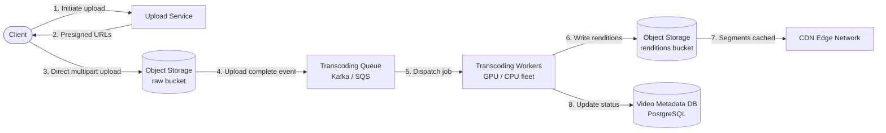
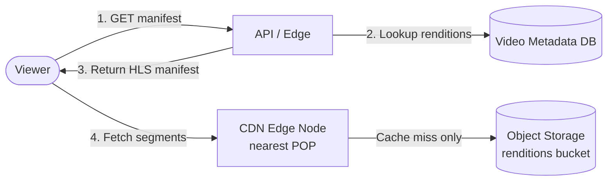

Video streaming is the canonical large-object delivery problem. The central difficulty is not storing video — object storage handles that cheaply — but getting the right bits to billions of devices, fast and without buffering, across every connection quality. Every architectural choice here flows from one constraint: **egress bandwidth is the dominant cost and the dominant bottleneck**.

## 1. Requirements

*Functional:*
- **Upload video:** creators upload raw video files (any resolution, codec, container).
- **Transcode:** the platform converts raw uploads into multiple resolutions and codecs, stored as streamable segments.
- **On-demand playback:** viewers request a video and receive a smooth adaptive-bitrate stream.
- **Discovery & metadata:** title, description, thumbnail, view count — out of scope for depth but inform the data model.
- *Extension:* live streaming (low-latency ingest, near-real-time segments) — noted but not designed in depth here.

*Non-functional:*
- **Scale:** 500M registered users; ~50M daily active viewers; ~500 hours of video uploaded every minute.
- **Watch-hours:** billions of watch-hours per day across the globe.
- **Smooth playback:** rebuffering events should be rare; startup latency under 2 seconds on a good connection.
- **Global low latency:** content served from edge nodes close to the viewer, not from a central origin.
- **High availability:** 99.99% — a streaming outage is immediately visible and brand-damaging.
- **Durability:** uploaded content must not be lost; raw and transcoded files replicated across availability zones.

## 2. Estimation

**Storage — what the numbers look like:**

- 500 hours of video uploaded per minute → 30,000 hours/hour → ~720,000 hours/day.
- Raw 1080p video: ~2 GB/hour. After transcoding into 4–5 renditions (360p, 480p, 720p, 1080p, 4K), total per uploaded hour ≈ ~8 GB (renditions sum to ~4× the original because lower resolutions are much smaller).
- Daily new storage: 720,000 hours × 8 GB ≈ **~5.8 PB/day** (before replication). Over a year: ~2,000 PB = **~2 exabytes** of video.

Storage is expensive but manageable for a hyperscaler. The more pressing number is bandwidth.

**Egress bandwidth — the real constraint:**

- 50M DAUs watching an average of 60 minutes/day = 50M × 1 hr = 50M watch-hours/day.
- Average bitrate across all devices ≈ 2 Mbps.
- Peak concurrent viewers ≈ 10% of DAUs = 5M viewers.
- Peak egress: 5M × 2 Mbps = **10 Tbps**.

At cloud egress pricing (~$0.02–0.08/GB depending on region), 10 Tbps sustained is financially ruinous without a CDN. This is why the architecture is: **object storage (origin) + CDN (edge)**. The CDN absorbs the egress; origin traffic stays a fraction of total.

**Transcoding compute:**

- 1 hour of raw 4K video takes ~20–60 minutes of GPU/CPU time to transcode into all renditions (varies by codec — AV1 is 10× more expensive to encode than H.264 but produces smaller files).
- At 720,000 hours/day of upload, transcoding is a continuous, massive parallel workload — it must be async and horizontally scalable.

These numbers force three decisions: **object storage** for video files, **async transcoding workers** behind a queue, and **CDN** for delivery.

## 3. API

```
-- Upload: two-phase (multipart)
POST /v1/uploads/initiate
  Body: { title, file_size_bytes, content_type }
  Response: { upload_id, upload_urls: [{ part_number, presigned_url }] }
  -- Client uploads parts directly to object storage via presigned URLs

POST /v1/uploads/{upload_id}/complete
  Body: { parts: [{ part_number, etag }] }
  Response: { video_id, status: "processing" }

-- Playback: manifest + segments
GET /v1/videos/{video_id}/manifest.m3u8   -- HLS master playlist (lists renditions)
  Response: HLS/DASH manifest with segment URLs pointing to CDN edge

GET /v1/videos/{video_id}/status
  Response: { video_id, status: "processing" | "ready" | "failed", available_renditions: [...] }

-- Metadata
GET /v1/videos/{video_id}
  Body: { title, description, duration_sec, thumbnail_url, view_count, ... }
```

The presigned-URL pattern is critical: the client uploads directly to object storage, bypassing the upload service for the actual bytes. The upload service never touches the raw payload — it only orchestrates. This avoids a bottleneck and lets object storage handle the heavy lifting.

## 4. Data model & storage choice

### Video metadata — relational DB

```
videos (
  video_id       UUID        PRIMARY KEY,
  owner_id       UUID,
  title          TEXT,
  description    TEXT,
  duration_sec   INT,
  status         ENUM('uploading','processing','ready','failed'),
  thumbnail_url  TEXT,
  created_at     TIMESTAMP,
  view_count     BIGINT
)

renditions (
  video_id       UUID,
  resolution     TEXT,       -- e.g. "1080p", "720p", "360p"
  codec          TEXT,       -- "h264", "vp9", "av1"
  bitrate_kbps   INT,
  segment_prefix TEXT,       -- CDN path prefix for this rendition's segments
  PRIMARY KEY (video_id, resolution, codec)
)
```

PostgreSQL (with read replicas) handles this comfortably. Video metadata is small, relational, and benefits from transactions (status transitions during transcoding are write-light). See [Databases & Storage](/building-blocks/databases/) for the SQL vs NoSQL decision framework.

### Video files — object storage + CDN

- **Raw uploads:** stored in object storage (S3, GCS) under a private bucket. Read only by transcoding workers; never served to viewers.
- **Transcoded segments:** stored in a public-read object storage bucket, organized as `/{video_id}/{rendition}/{segment_number}.ts`. This is the CDN origin.
- **CDN layer:** sits in front of object storage. Viewers receive segment URLs pointing to CDN edge nodes, not to origin. Cache-hit ratio is the key metric.

Why not a file system or database for video? Raw video files are multi-GB blobs with no query patterns beyond "give me this file." Object storage gives durable, geo-replicated, infinitely scalable blob storage at a fraction of block-storage cost. CDNs are built to sit in front of it.

## 5. High-level design

**Upload path:**



**Playback path:**



The playback path is intentionally thin on the application side: the API returns a manifest; the CDN does the heavy lifting for segment delivery. The API servers are stateless and autoscale independently.

:::note[In the real world]
Netflix operates [Netflix Open Connect](https://openconnect.netflix.com/), a purpose-built CDN of Open Connect Appliances (OCAs) embedded directly inside ISP networks. Rather than serving content from cloud origin on demand, Netflix proactively pushes popular titles to OCAs during off-peak "fill windows" overnight. The vast majority of Netflix traffic is served from an OCA physically located inside the viewer's ISP — often within a few router hops. This is an extreme form of CDN pre-positioning: the content travels from Netflix's cloud to the ISP's data center *before* anyone requests it, so the first viewer's stream is already local. For implementation details, see [Serving 100 Gbps from an Open Connect Appliance](https://netflixtechblog.com/serving-100-gbps-from-an-open-connect-appliance-cdb51dda3b99).
:::

## 6. Deep dives

### (a) Async transcoding pipeline

Raw video cannot be streamed directly. Problems: the upload codec may be unsupported by most devices; the file may be enormous; there are no segments for adaptive bitrate; the container format may not support HTTP range requests cleanly. Transcoding solves all of this.

The naive approach — transcode the whole file end-to-end — is too slow. A 2-hour film at 4K takes hours to transcode serially. The production approach is **parallel chunk transcoding**:

1. **Split** the raw file into short independent segments (e.g., 2–10 seconds each, aligned to keyframes) using a splitter worker.
2. **Dispatch** each chunk as a separate transcoding task on a message queue (Kafka or SQS). See [Messaging & Async](/building-blocks/messaging/) for queue semantics.
3. **Transcode in parallel:** a fleet of workers each picks up one chunk and encodes it into all target renditions (360p/480p/720p/1080p at H.264, plus 1080p at VP9/AV1 for supported clients). Workers are stateless and horizontally scalable.
4. **Reassemble:** once all chunks at all renditions are complete, a manifest generator assembles the HLS/DASH playlist and writes the final segment index to object storage. The video status flips to `ready`.

This is embarrassingly parallel: 1,000 chunks × 5 renditions = 5,000 independent tasks. The transcoding backlog can be drained by adding workers — the queue absorbs the burst.

Codec tradeoff: **H.264** is fast to encode (minutes) and universally supported. **VP9** and **AV1** produce 30–50% smaller files at the same quality but take 5–10× longer to encode. A practical choice: encode H.264 first (available quickly), then encode AV1 asynchronously for storage savings and bandwidth efficiency on repeat views.

### (b) Adaptive bitrate streaming (HLS / DASH)

HLS (HTTP Live Streaming) and DASH (Dynamic Adaptive Streaming over HTTP) work on the same principle:

- Each rendition (bitrate/resolution pair) is sliced into short segments (2–6 seconds).
- A **manifest file** (`.m3u8` for HLS, `.mpd` for DASH) lists all available renditions and the URLs of their segments.
- The client starts by fetching the manifest. It measures its current bandwidth by timing how fast recent segments arrived, then picks the rendition tier that fits — typically targeting ~80% of available bandwidth to leave headroom.
- On each segment boundary, the client can switch tiers up or down. A sudden bandwidth drop mid-video → the next segment is fetched at a lower bitrate rather than stalling.

The result is smooth playback across a wide range of network conditions. The cost: some startup latency (client fetches manifest, then first segment) and a small quality lag when conditions change.

:::tip
ABR is a client-side algorithm, not server-side. The server just delivers whichever segments the client asks for. This simplicity is intentional: it makes the server stateless and the CDN trivially cacheable. All intelligence is at the edge.
:::

### (c) CDN strategy

A CDN edge node is a cache of video segments at a network location close to viewers. Cache-hit ratio is the primary metric — a miss sends a request back to origin (object storage), adding latency and egress cost.

Key levers:

- **Segment TTL:** video segments are immutable once created (a given video at a given rendition never changes). Set a long TTL (days to weeks) on segment files. Cache-control headers on the object storage responses propagate to the CDN.
- **Manifest TTL:** the manifest is mostly immutable after transcoding completes, but may be updated (new renditions added). A shorter TTL (minutes to hours) is appropriate.
- **Pre-positioning popular content:** before a major release (a new episode, a live event pre-roll), proactively push segments to CDN edge nodes in target geographies. This warms the cache before the traffic spike, avoiding a thundering herd of origin requests. See [Caching](/building-blocks/caching/) for stampede mitigation patterns.
- **Long-tail content:** most uploads are watched rarely. Long-tail segments may sit cold in object storage and be fetched through CDN on demand with lower cache-hit ratios. For rare content this is acceptable — the cost is occasional origin fetches, not sustained egress load.
- **CDN selection by geography:** point the manifest's segment base URL at the CDN POP closest to the viewer (via Anycast or GeoDNS). Viewers in Europe should not fetch segments from a US edge node.

### (d) Thumbnail and preview sprite generation

Thumbnail and preview sprite generation is a pipeline byproduct, not a separate system. After transcoding completes:

- The transcoding pipeline (or a lightweight post-processing worker) samples frames at regular intervals (e.g., every 5 seconds) to generate a **sprite sheet** — a single image tiling many thumbnails.
- The player uses the sprite sheet to display preview thumbnails as the viewer scrubs through the progress bar, without fetching individual frames.
- The default thumbnail is extracted at a configurable timestamp (or selected by a model that picks a high-quality frame).

Both outputs are uploaded to object storage and served via CDN like any other video asset. No special infrastructure needed — it's just another async task on the transcoding queue.

## 7. Bottlenecks & scaling

### Transcoding backlog under upload spikes

Upload spikes (a news event, a platform promotion) can flood the transcoding queue faster than workers can drain it. Mitigations:

- **Autoscale workers:** transcoding workers are stateless and pull from a queue. A queue-depth metric triggers auto-scaling. Cloud GPU instances can be added in minutes.
- **Priority lanes:** separate queues for premium/verified creators (lower latency SLA) and general uploads. Workers are assigned across lanes by priority.
- **Backpressure on upload:** if the queue depth exceeds a threshold, the upload service can return a `202 Accepted` with an estimated availability time and throttle new upload initiations. Users still upload; processing is just queued.

### CDN cache-hit ratio and hot content

A low cache-hit ratio means most requests hit origin — the egress cost and latency consequence of a CDN miss. Key failure mode: a viral video suddenly gets millions of viewers from a cold CDN edge.

- Pre-warm the CDN for anticipated high-traffic content (new releases, trending videos).
- Monitor cache-hit ratios per edge POP and per video. A POP with low hit ratios for a popular video signals a configuration or routing issue.
- For truly massive spikes (a major event), consider multi-CDN routing: spread load across multiple CDN providers to avoid exhausting a single provider's edge capacity.

### Origin egress

Even with a well-warmed CDN, some fraction of requests reaches origin (cold content, cache misses on new uploads, HEAD requests). Object storage has high read bandwidth but is not free. Mitigations: keep segment files small (2–4 second segments), ensure immutable cache headers eliminate unnecessary re-fetches, and use object storage tiering (move rarely-accessed videos to cheaper cold storage after a threshold).

### Long-tail unpopular content

The vast majority of uploaded videos are watched rarely. These sit cold in object storage and are fetched by CDN on demand. The CDN acts as a pass-through for them — no meaningful caching benefit. This is acceptable: the egress cost of a video watched 5 times is negligible. Object storage is the right home; no special handling needed beyond lifecycle policies to move old content to archival tiers.

### SPOF and redundancy

| Component | Redundancy |
|---|---|
| Upload service | Stateless, N instances behind a load balancer; auto-scales |
| Object storage | Multi-AZ replication (S3-style); provider handles durability |
| Transcoding queue | Kafka / SQS — replicated, durable; jobs survive worker crashes |
| Transcoding workers | Stateless; failed jobs re-queued via visibility timeout / dead-letter queue |
| Video metadata DB | PostgreSQL with read replicas; primary failover via managed service |
| CDN edge nodes | Multiple POPs globally; a failed POP routes to the next nearest |
| CDN origin failover | Object storage in multiple regions; CDN can fail over to a secondary origin |

**Critical observation:** the playback path has no single point of failure once content is in the CDN. A transcoding worker crash stalls that job; it does not affect viewers watching already-transcoded content. Decoupling the upload/transcode path from the playback path via object storage is the key resilience property of this design.

## 8. Key tradeoffs summary

| Decision | Choice | Why |
|---|---|---|
| Upload method | Client → presigned URL → object storage | Avoids upload service as a bottleneck; object storage scales independently |
| Transcoding | Async, chunked parallel | Reduces latency from hours to minutes; workers scale independently |
| Codec strategy | H.264 first, AV1 async | Fast availability vs. long-term storage/bandwidth savings |
| Delivery | HLS/DASH + CDN | ABR handles network variability; CDN absorbs egress cost |
| CDN warming | Proactive pre-position | Prevents cold-cache thundering herd on popular content |
| Metadata storage | PostgreSQL | Video metadata is relational, write-light; benefits from ACID for status transitions |

For further practice, see [Practice Problems](/case-studies/practice-problems/) and the [Specialized Components](/building-blocks/specialized-components/) reference for ID generation patterns used in the transcoding pipeline.
