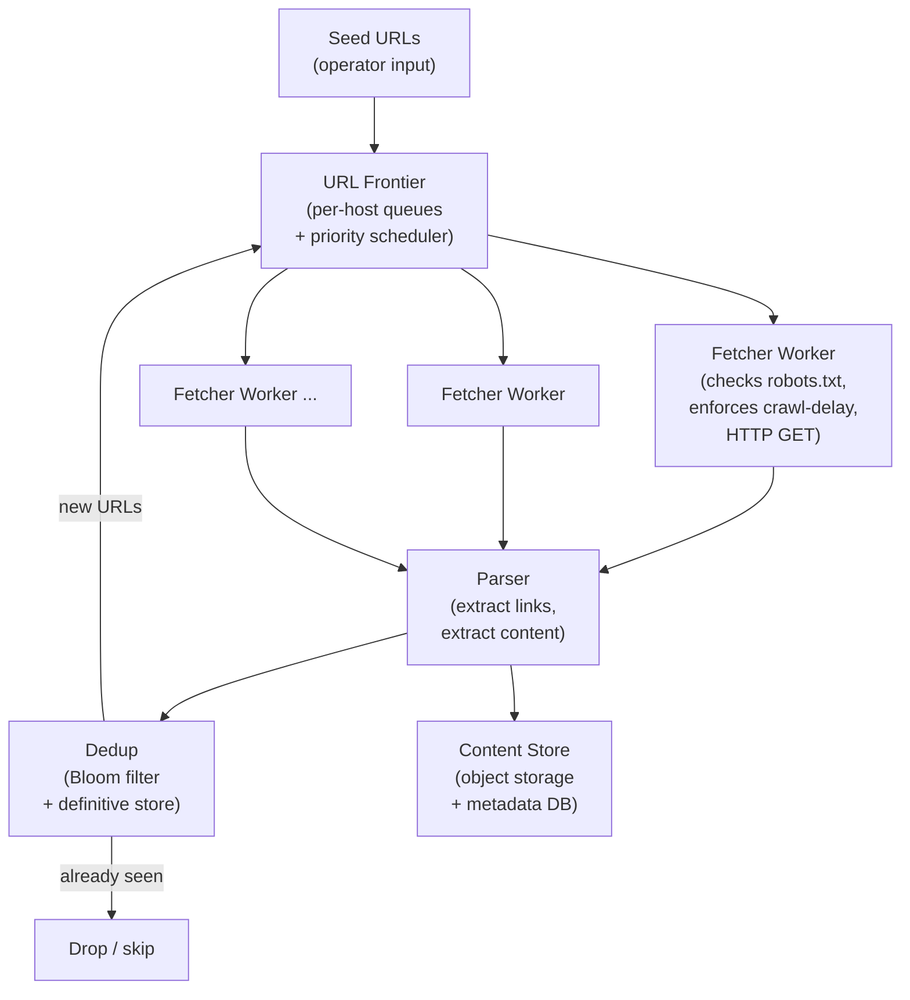

A web crawler is a distributed pipeline that discovers, fetches, parses, and stores web pages at internet scale. The central difficulty is not fetching a single page — it is orchestrating billions of fetches while being a polite citizen of the web, deduplicating an ever-growing frontier, and recovering from failures without losing progress.

## 1. Requirements

*Functional:*
- Accept seed URLs and crawl the web breadth-first from those seeds.
- Extract all outbound hyperlinks from each page and enqueue new URLs for crawling.
- Store (and optionally index) page content for downstream consumers (search indexers, ML pipelines, archivists).
- Respect `robots.txt` — check the crawl policy for each host before fetching any page on that host.
- Support recrawling: pages must be revisited periodically to capture updates.

*Non-functional:*
- **Scale:** billions of pages crawled; tens of billions of URLs in the frontier.
- **Politeness:** never overload any single host — enforce a minimum inter-request delay per host, and obey `Crawl-Delay` directives.
- **Deduplication:** avoid fetching the same URL twice in the same crawl cycle; avoid storing duplicate content (near-identical pages with different URLs).
- **Fault tolerance:** a crashed worker must not cause URLs to be silently dropped — the frontier is the source of truth.
- **Distributed:** crawling at billions of pages/day requires hundreds of worker machines operating in parallel without stepping on each other.

## 2. Estimation

**Target scale:** 5 billion pages, recrawled every 30 days.

- Pages per second: 5B pages ÷ (30 × 86,400 s) ≈ **~2,000 pages/s**.
- Average page size (compressed HTML): ~200 KB → raw throughput **~400 MB/s**.
- Content storage: 5B pages × 200 KB = **~1 PB** per crawl cycle (before compression; gzip typically halves this).
- Frontier size: each page yields ~50 extracted links on average → 5B × 50 = 250B candidate URLs; after dedup the live frontier stays in the tens of billions range at peak. A URL string is ~100 bytes → frontier state alone is **multiple terabytes**.
- Workers needed: if each worker sustains ~50 pages/s (network I/O dominates), 2,000 pages/s requires **~40 worker machines** minimum; in practice 100–200 workers provide headroom and fault tolerance.

**What the numbers force:**
- The frontier cannot fit in one machine's memory — it must be distributed.
- The seen-URL set cannot be a hash set in RAM — need a compact probabilistic structure (Bloom filter).
- Per-host rate limiting must be enforced locally on each worker to avoid cross-worker coordination overhead.

## 3. API

A web crawler is an internal pipeline, not a user-facing service. There is no public REST API; the interfaces are between pipeline stages.

```
-- Seed injection (operator → Frontier service)
POST /frontier/seeds
Body: { urls: ["https://example.com/", ...], priority: int }

-- Frontier: dequeue a batch of crawlable URLs (Worker → Frontier)
GET /frontier/next?worker_id=w42&batch_size=50
Response: [{ url, host, priority, last_crawled_at }, ...]

-- Frontier: report completion and enqueue new links (Worker → Frontier)
POST /frontier/complete
Body: {
  fetched_url:  "https://example.com/",
  status:       200,
  extracted:    ["https://example.com/about", ...],
  content_hash: "sha256:...",
  crawled_at:   epoch
}

-- robots.txt cache (Worker → Robots Cache service)
GET /robots?host=example.com
Response: { crawl_delay_ms: 1000, disallowed: ["/private/", ...] }
```

The pipeline design means each step hands off to the next via the frontier queue and content store — no synchronous chain of calls from end to end.

## 4. Data model & storage choice

### URL frontier

The frontier is a priority queue of URLs to fetch, organized for politeness. It has two logical layers:

1. **Priority component** — ranks URLs by importance (PageRank estimate, freshness need, depth from seed) and maps each to a **per-host queue**.
2. **Per-host queues** — one FIFO queue per host. Workers pull from host queues, not from a global queue, so that crawl-delay enforcement is local and trivial: "when was the last fetch from this host?" lives on the worker.

Storage: a distributed message queue (Kafka topics partitioned by `murmur2(host)`) works well. The partition-by-host property gives each consumer group (worker) ownership of a set of hosts — politeness becomes a consumer-side concern rather than a coordination problem.

### Seen-URL set (deduplication)

A naive hash set of 250B URLs would require ~25 TB of memory. Instead, use a **Bloom filter**:

- A Bloom filter answers "have we seen this URL?" with **no false negatives** (if the filter says "not seen," it has definitely not been seen) and a **tunable false-positive rate** (occasionally it will say "seen" for a new URL — that URL gets skipped, which is acceptable).
- At a 0.1% false-positive rate, a Bloom filter for 50B URLs requires roughly **~90 GB** — fits on a single large machine or a small Redis cluster.
- Back it with a **definitive store** (a key-value store keyed by URL hash) for the small fraction of cases where correctness matters (e.g., when the filter is rebuilt after a restart).

### Content store

Raw page content goes to **object storage** (S3 or equivalent): cheap, durable, effectively unlimited. The database stores only metadata.

```
-- pages table (PostgreSQL or wide-column store)
url           TEXT PRIMARY KEY
host          TEXT
content_hash  TEXT   -- SHA-256; dedup identical content across URLs
http_status   INT
content_ref   TEXT   -- pointer into object storage (e.g., S3 key)
crawled_at    TIMESTAMP
next_crawl_at TIMESTAMP
depth         INT
```

### Link graph

A directed edge table `(src_url_hash → dst_url_hash)` stored in a wide-column store (Cassandra) supports PageRank recomputation and link analysis without touching the raw content store. See [Databases & Storage](/building-blocks/databases/) for the write-throughput justification for wide-column.

## 5. High-level design



**Data flow:** A worker dequeues a URL from its assigned host queue, checks `robots.txt` (cached locally), waits for the per-host crawl delay to elapse, then issues an HTTP GET. The response goes to the Parser, which extracts outbound links and page content in parallel. Extracted links are checked against the Bloom filter: new URLs are enqueued back to the Frontier (with computed priority); already-seen URLs are dropped. Page content is written to object storage with its metadata record.

## 6. Deep dives

### (a) URL frontier design: per-host queues and politeness

A naive single global FIFO queue breaks politeness immediately: workers will pull URLs from the same popular host (e.g., `en.wikipedia.org`) back-to-back with no delay, effectively DDoS-ing it.

The fix is a two-tier structure:
- **Back queues (per-host):** one FIFO queue per host. URL `https://example.com/page-42` always goes into `example.com`'s queue.
- **Front queues (priority):** N priority buckets. A URL's priority is computed from estimated importance (inlink count, freshness score, depth). A router maps URLs from front-queues into back-queues.
- **Worker selector:** a worker polls a "host heap" — a min-heap ordered by `next_fetch_time` per host. A worker pops the host with the earliest allowed fetch time, pulls its next URL, fetches it, then re-inserts the host with `next_fetch_time = now + crawl_delay`. This guarantees politeness per host with no global lock.

This structure is essentially a **distributed BFS with priority**: crawl important and fresh URLs sooner, while never hammering any single host.

### (b) Dedup at scale: Bloom filter mechanics

The Bloom filter is the right structure because:
1. **Memory:** 50B URLs × 1.44 bits/element at 1% FPR ≈ ~9 GB. Trivially fits in RAM.
2. **Speed:** a lookup is O(k) hash computations (k ≈ 7 for 1% FPR) — nanoseconds.
3. **Acceptable error mode:** a false positive means a valid new URL is skipped. Given tens of billions of URLs, occasionally missing one is far better than the cost of exact deduplication.

For correctness-critical cases (rebuilding the filter after a crash, or auditing), back the Bloom filter with a **definitive URL store** (a Redis cluster or Cassandra table keyed by `sha256(normalized_url)`). The filter handles 99.9%+ of lookups; the definitive store is the ground truth.

URL normalization is critical before any dedup check: strip fragments (`#section`), canonicalize scheme/host to lowercase, sort query parameters, resolve relative paths. Two URLs that look different but point to the same resource must hash identically.

See [Specialized Components](/building-blocks/specialized-components/) for a full treatment of Bloom filters and other probabilistic data structures.

### (c) Politeness: robots.txt, crawl-delay, and DNS caching

**robots.txt:** fetch and cache `https://{host}/robots.txt` once per host per day. Parse disallowed paths and `Crawl-Delay`. A worker must check the cache before every fetch — never hit a disallowed path. Serve the robots.txt cache from a shared fast store (Redis) with a local in-process LRU per worker.

**Crawl-Delay enforcement:** if `robots.txt` specifies `Crawl-Delay: 5`, the worker must wait at least 5 seconds between any two requests to that host. The per-host queue structure makes this easy: the worker's host heap tracks `next_allowed_fetch_time` per host.

**DNS resolution:** DNS is a real and often overlooked bottleneck. Each worker resolves tens of thousands of distinct hostnames. Uncached DNS lookups add tens of milliseconds per fetch and can flood the resolver. Each worker maintains its own in-process DNS cache (e.g., TTL-bounded hash map) so repeated fetches from the same host (common when draining a host queue) require zero DNS round-trips after the first.

:::note[In the real world]
The original Google crawler, described by Brin & Page, addressed exactly these issues. Each crawler maintained its **own DNS cache** to avoid resolver overhead, and used **asynchronous I/O with multiple queues** — each URL progressing through states (DNS resolve → connect → send → receive) — so that hundreds of connections were kept in flight simultaneously across different fetch stages. This asynchronous, multi-queue design is the same principle behind modern event-loop-based crawlers (Node.js, Python asyncio, Go goroutines).

[The Anatomy of a Large-Scale Hypertextual Web Search Engine (Brin & Page, 1998)](http://infolab.stanford.edu/pub/papers/google.pdf)
:::

### (d) Distributed coordination: partitioning the URL space

Assigning each worker a **partition of hosts** (by `hash(host) mod N`) means:
- Each worker owns all URLs for its assigned hosts → politeness enforcement is purely local (no cross-worker coordination needed for crawl delay).
- The Frontier service can route enqueued URLs to the correct worker's partition deterministically.
- Adding workers reshuffles host assignments; a consistent hashing ring minimizes the reshuffle (see [Databases & Storage](/building-blocks/databases/)).

**Crawler traps and infinite URL spaces:** some sites generate infinite URLs (session IDs in query params, calendar pages, pagination without end). Defenses:
- **Max URL length:** discard URLs longer than ~2 KB.
- **Max depth:** do not crawl beyond N hops from a seed (depth tracked in the frontier record).
- **Query-parameter normalization:** strip or canonicalize known noise parameters (`?sessionid=`, `?utm_source=`).
- **Path-segment repeat detection:** if a URL contains the same path segment more than 3 times (`/a/a/a/...`), it is likely a trap.

**Duplicate content (same content, different URLs):** compare `sha256(content)` at ingest time; if the hash matches a stored page, record the duplicate mapping but skip re-storing. This also catches mirror sites.

## 7. Bottlenecks & scaling

**DNS resolution bottleneck:** a crawler hitting millions of unique hosts resolves each hostname at least once. Without per-worker caching, DNS becomes the throughput ceiling. Mitigation: per-worker in-process DNS cache (as above) plus a local caching resolver (Unbound/BIND) deployed on each crawler host.

**Frontier size and growth:** at peak, the frontier holds tens of billions of URLs. Keeping all of these in memory is infeasible; the frontier must spill to disk (Kafka's log-based storage handles this naturally). Prioritization means not all URLs need to be in the "hot" in-memory portion — lower-priority URLs can stay on disk until their turn.

**Hot hosts:** a site like Wikipedia, Reddit, or a major news outlet may have millions of pages. All of them end up in one per-host queue. Since the worker enforces a crawl delay, this is fine for politeness — but that one host's queue may take weeks to drain. Prioritize the most important pages first (shallow pages, high-inlink pages) and deprioritize deep/low-value pages. Async message queues handle large queue depths gracefully (see [Messaging & Async](/building-blocks/messaging/)).

**Throughput vs politeness tension:** crawling faster means shorter crawl-delay intervals. Too short → hosts block your IP. Too long → the 30-day recrawl cycle is missed. Calibrate crawl-delay per host: large CDN-backed sites tolerate shorter delays; small personal sites need longer gaps. Use `robots.txt` directives as the floor, not the ceiling.

**SPOF and redundancy:**

| Component | Failure mode | Mitigation |
|---|---|---|
| Fetcher workers | Process crash | URLs remain in Frontier queue; another worker picks them up |
| URL Frontier (Kafka) | Broker failure | Kafka replication (RF 3); partitions re-leader within seconds |
| Bloom filter node | Crash / restart | Rebuild from definitive URL store; accept temporary duplicate fetches |
| Definitive URL store (Redis) | Shard failure | Redis Cluster with replicas; brief window of false-new URLs |
| Content store (object storage) | Regional outage | Cross-region replication (S3 CRR); writes block until durable |
| robots.txt cache (Redis) | Unavailable | Fail-safe: treat unknown robots.txt as "allow all" and log alert |

For additional practice with crawler-adjacent problems (search indexing, URL shorteners, link graphs), see [Practice Problems](/case-studies/practice-problems/).

