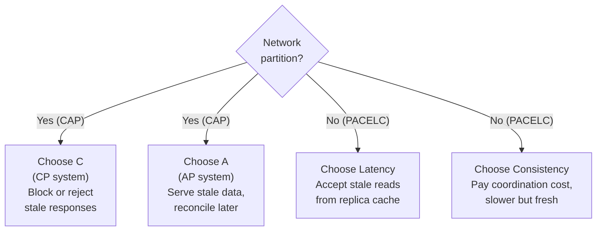

## CAP theorem

In a distributed system you can have at most two of: **Consistency** (every read sees the latest write), **Availability** (every request gets a non-error response), **Partition tolerance** (the system keeps working despite network failures between nodes).

The honest framing: networks *will* partition, so **P is not optional** for any real distributed system. The real choice during a partition is **C vs A**:

- **CP** — refuse to serve (or block) rather than return possibly-stale/wrong data. Choose this when correctness is non-negotiable: banking ledgers, inventory, anything where being wrong is worse than being down. (e.g., traditional RDBMS, ZooKeeper, etcd, MongoDB by default.)
- **AP** — always answer, accept that some answers may be stale and reconcile later. Choose this when availability beats perfect freshness: social feeds, product catalogs, DNS, shopping carts. (e.g., Cassandra, DynamoDB, Riak.)

## PACELC — the more useful version

CAP only describes behavior *during a partition*. **PACELC** extends it: *if Partitioned, choose A or C; **E**lse (normal operation), choose **L**atency or **C**onsistency.* This matters because most of the time there's no partition, and you're still trading consistency for speed every time you add a replica or a cache. This is the tradeoff you actually face daily.

## Partition decision diagram

## Consistency models ladder

Not all consistency is the same. This ladder goes from strongest (most correct, most expensive) to weakest (cheapest, most available). Each step down buys you performance at the cost of guarantees.

| Level | What it means | Example datastores / use-cases |
|---|---|---|
| **Strong / Linearizable** | Every read returns the most recent write, as if there is exactly one copy. Operations appear instantaneous and in a global total order. | Google Spanner, etcd, ZooKeeper — distributed locks, bank balances, inventory counts |
| **Sequential** | All operations appear to execute in some sequential order consistent with each process's local order. Weaker than linearizable: no real-time constraint on when a write becomes visible. | Single-node databases in many default configs |
| **Causal** | Operations that are causally related (A happened before B) are seen in that order by everyone. Unrelated operations may appear in different orders to different nodes. A good middle ground. | MongoDB with causal sessions, CockroachDB — collaborative editing, messaging threads |
| **Read-your-own-writes** | You always see your own updates immediately, even if other readers see stale data for a while. | Any system routing a user's reads to the replica that handled their writes — critical for UX after profile edits, comment posts |
| **Monotonic reads** | Once you have seen a value, you will never see an older one. No time travelling backwards. | Sticky session to same replica, or client-side version tracking |
| **Eventual** | If writes stop, all replicas will eventually converge to the same value. No timing guarantee. | Cassandra, DynamoDB, Riak — likes, view counts, DNS, social feeds |

:::note[Pick the weakest model that is correct for your use case]
Stronger models are easier to reason about but cost latency and availability. The goal is not always "as strong as possible" — it is "strong enough that users do not notice correctness problems."
:::

## CP vs AP decision table

Use this as a quick reference when choosing a datastore in an interview or design review:

| Scenario | Choose | Why | Example datastores |
|---|---|---|---|
| Bank account balance / ledger | **CP** | Wrong balance is worse than a brief outage | PostgreSQL, Spanner, CockroachDB |
| Inventory / stock count | **CP** | Overselling is a real business problem | MySQL, etcd, Spanner |
| Distributed locks / leader election | **CP** | Two nodes thinking they are the leader causes data corruption | ZooKeeper, etcd |
| User session / auth tokens | **CP** | Security: stale "logged out" state is dangerous | Redis (single node or strongly-consistent cluster) |
| Social media feed / timeline | **AP** | A post appearing 2 seconds late is fine; an error page is not | Cassandra, DynamoDB |
| Shopping cart | **AP** | Better to show a slightly stale cart than refuse to load | DynamoDB, Riak |
| Product catalog / pricing | **AP** | A price lagging by a few seconds is acceptable; downtime is not | Cassandra, DynamoDB |
| DNS resolution | **AP** | TTL-based staleness is by design; availability is paramount | anycast DNS, DynamoDB |
| Collaborative document editing | Causal | Ordering within a document matters; global ordering does not | MongoDB causal sessions, CRDTs |

## What actually happens during a partition

It helps to walk through a concrete scenario. Imagine two data-centre replicas: Node A (east) and Node B (west). A network failure cuts the link between them for 30 seconds.

**A CP system (e.g. etcd):**
1. Node B detects it cannot reach Node A and loses quorum.
2. Node B stops accepting writes and returns an error to clients: "service unavailable."
3. Node A continues serving the clients it can reach, because it still has quorum.
4. When the partition heals, both nodes are consistent — Node B simply had a 30-second outage.
5. *Trade-off:* clients connected to Node B saw errors. Correctness was preserved.

**An AP system (e.g. Cassandra with quorum = 1):**
1. Node B detects it cannot reach Node A.
2. Node B continues accepting reads and writes from its local clients.
3. Node A does the same.
4. During the partition, a user on each side could write conflicting updates to the same row.
5. When the partition heals, Cassandra resolves the conflict with "last write wins" (by timestamp) or a custom merge strategy. One update may be silently discarded.
6. *Trade-off:* clients never saw an error. Consistency was temporarily violated; a conflict was resolved after the fact.

Neither outcome is wrong. The right choice depends entirely on whether your application can tolerate brief errors (CP) or brief inconsistency (AP).

## Consistency models (from strong to weak)

- **Strong / linearizable:** every read returns the most recent write, as if there were a single copy. Easiest to reason about, most expensive (needs coordination, hurts latency/availability).
- **Causal:** operations that are causally related are seen in order by everyone; unrelated ones may differ. A good middle ground.
- **Eventual:** if writes stop, all replicas eventually converge. Cheapest and most available; readers may see stale data for a while. Fine for likes, view counts, feeds.

Client-centric guarantees worth knowing by name: **read-your-own-writes** (you always see your own updates — critical for UX after a user edits something), **monotonic reads** (you never see time go backwards), **monotonic writes** (your writes apply in order).

## ACID vs BASE

- **ACID** (classic relational transactions): **A**tomicity (all-or-nothing), **C**onsistency (constraints upheld), **I**solation (concurrent txns don't corrupt each other), **D**urability (committed data survives crashes).
- **BASE** (the NoSQL philosophy): **B**asically **A**vailable, **S**oft state, **E**ventual consistency. Trades strict guarantees for scale and availability.

## Isolation levels (the I in ACID, in practice)

From weakest to strongest, each prevents more anomalies at more cost:

- **Read Uncommitted** — can see uncommitted changes (*dirty reads*). Rarely used.
- **Read Committed** — only see committed data; default in many databases.
- **Repeatable Read** — re-reading a row in a transaction returns the same value (prevents *non-repeatable reads*).
- **Serializable** — transactions behave as if run one at a time. Strongest, slowest; prevents *phantom reads*.

You don't need to memorize the anomaly matrix, but you should know that "the database has a transaction" does not automatically mean "fully isolated" — the default is usually a weaker level, and choosing the level is a real decision.
